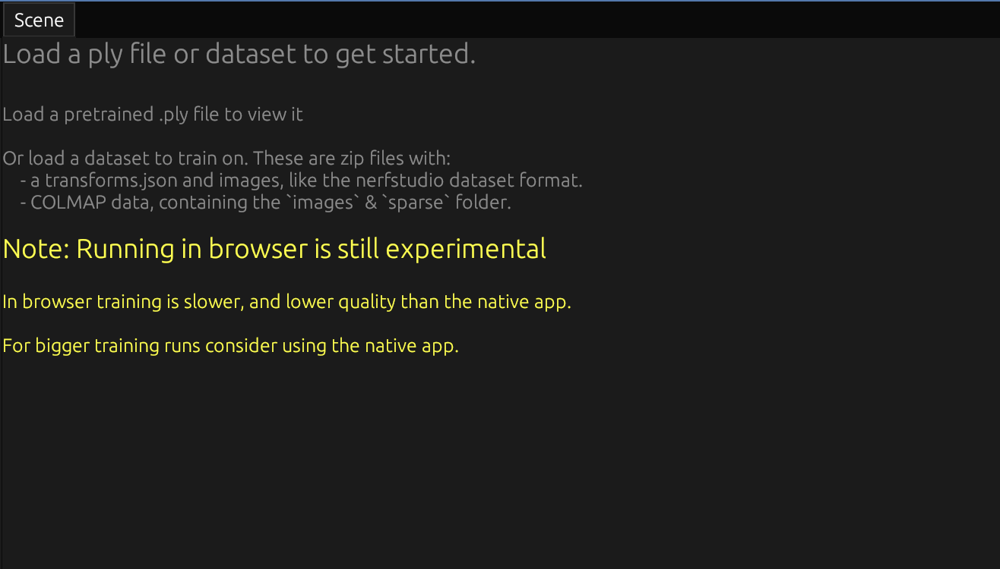

# 2.2 Developer Guide

This guide helps developers set up their environment, build the project, and contribute.

## 2.2.1 Development Environment Setup

To build and contribute to Brush, you'll need the following:

*   **Rust:** Install Rust using `rustup`. Brush requires Rust version 1.82 or newer.
    *   Visit [https://www.rust-lang.org/tools/install](https://www.rust-lang.org/tools/install) for installation instructions.
    *   The specific toolchain version required is pinned in `rust-toolchain.toml`.
    *   For an overview of how Brush uses Rust, see the **[Architecture Overview](../technical-deep-dive/architecture.md#rust-architecture)**.
*   **WASM Target (for Web builds):** If you plan to build the WebAssembly version, add the WASM target. This is required for compiling Rust code to run in web browsers.
    ```bash
    rustup target add wasm32-unknown-unknown
    ```
*   **Trunk (for Web builds):** Trunk is used to build and bundle the WASM application, managing JavaScript interop and assets for the web. You can install it via cargo:
    ```bash
    cargo install trunk
    ```
    Or see [Trunk's installation guide](https://trunkrs.dev/#install) for alternative methods.
*   **Rerun (Optional, for Visualization):** Brush uses [Rerun](https://rerun.io/) for enhanced visualization during training. You can install the CLI via cargo:
    ```bash
    cargo install rerun-cli
    ```
    Or visit [Rerun's installation guide](https://www.rerun.io/docs/getting-started/installing) for other installation options.
    
    > [!NOTE]
    > If `rerun-cli` is not installed, the Rerun features in the UI can be enabled but will not display visualizations.
*   **Desktop System Dependencies:** Building the native desktop application requires certain development libraries depending on your operating system:
    *   **Linux (Wayland):** Requires `libwayland-dev`, `libxkbcommon-dev` (Debian/Ubuntu) or `wayland-devel`, `libxkbcommon-devel` (Fedora).
    *   **Linux (X11):** Requires `libx11-dev`, `libxcb-render0-dev`, `libxcb-shape0-dev`, `libxcb-xfixes0-dev` (Debian/Ubuntu) or `libX11-devel`, `libxcb-devel` (Fedora).
    *   **Linux (Common):** You may also need fontconfig libraries (`libfontconfig1-dev` or `fontconfig-devel`).
    *   **macOS:** Standard Xcode command-line tools should suffice.
    *   **Windows:** Standard MSVC build tools (usually installed with Visual Studio) are required.
*   **Android System Dependencies:** Building for Android requires:
    *   Android SDK
    *   Android NDK
    *   winit with android-game-activity support
    *   android_logger
    *   jni
    See `crates/brush-android/README.md` for detailed setup instructions.
*   **IDE Setup:** Any editor with Rust support will work well with Brush:
    *   [Visual Studio Code](https://code.visualstudio.com/) with the [rust-analyzer](https://marketplace.visualstudio.com/items?itemName=rust-lang.rust-analyzer) extension is popular
    *   Other editors like CLion, Vim, or Emacs with rust-analyzer also work well
    *   The project includes extensive clippy configuration for consistent code quality

## 2.2.2 Building the Project

Once the environment is set up, you can build Brush from the root directory of the repository. For details about the crates you're building, see the **[API Reference](../api-reference.md#41-key-public-apis)**.

*   **Desktop (Native Application):**
    *   Development build: `cargo build` (Builds all targets, including `brush_app`)
        * Uses `opt-level = 1` for faster compilation while maintaining decent performance
    *   Optimized release build: `cargo build --release` (Builds all targets, including `brush_app`)
        * The `dist` profile inherits from release and adds thin LTO for better optimization
    *   To build and run the desktop app directly:
        *   Development: `cargo run --bin brush_app`
        *   Release: `cargo run --bin brush_app --release`
*   **Web (WebAssembly):**
    *   Development build and local server: `trunk serve`
    *   Optimized release build: `trunk build --release`

    The WebAssembly version relies on WebGPU features, so please note the following requirements:
    * A browser with WebGPU support and the MAPPABLE_PRIMARY_BUFFERS feature
    * Firefox users may need to enable WebGPU manually by setting `dom.webgpu.enabled` in `about:config`
    
    
    *The web UI notes its experimental status. Due to WebGPU limitations, performance and features may differ from desktop.*
*   **Command-Line Interface (CLI only):**
    *   Build the CLI executable: `cargo build --release -p brush-cli`
    *   The executable will be located at `target/release/brush`.

## 2.2.3 Running Examples

Brush does not bundle large 3D sample datasets or pre-trained `.ply` models directly within the repository. For instructions on obtaining and using such datasets to experiment with Brush's full 3D capabilities, please refer to the **[User Guide](user-guide.md#213-core-ui-workflows)**. For technical details about how Brush processes these datasets, see the **[Reconstruction Pipeline](../technical-deep-dive/reconstruction-pipeline.md)**.

The repository includes one small, self-contained example primarily for testing or basic demonstration:

*   **`train-2d`**: A simple application that demonstrates overfitting the 2D Gaussian Splatting components on a single image (`crab.jpg`). Uses tokio with multi-threading enabled for parallel processing. Useful for:
    * Testing the core rendering and training components
    * Understanding the 2D rendering/training pipeline
    * Experimenting with training parameters
    
    Run the 2D training example from the repository root:
    ```bash
    cargo run --example train-2d
    ```

## 2.2.4 Running Tests & Coverage

The project includes a suite of unit tests primarily focused on core algorithms and GPU kernels. Tests are run in CI using Rust 1.85.0. For details about the algorithms being tested, see the **[Rendering Pipeline](../technical-deep-dive/rendering-pipeline.md)** documentation.

*   **Run the test suite:** To execute all tests across the workspace, run the following command from the root directory. The `--workspace` flag tells Cargo to run tests for all crates in the project.
    ```bash
    cargo test --workspace
    ```
*   **Test Coverage Scope:**
    *   Unit tests currently focus on functionalities within:
        * `brush-prefix-sum`: Prefix sum operations
        * `brush-sort`: Sorting algorithms
        * `brush-render`: Rendering pipeline and GPU kernels
        * `brush-train`: Training loop and optimization
    *   Test coverage for application-level logic (`brush-app`, `brush-cli`), UI interactions (`brush-ui`), and end-to-end dataset loading/processing is limited.
    *   Manual testing is recommended for verifying UI behavior and complete workflows.

*   **Optional Features:**
    * `tracy` - Enables performance tracing integration
    * `tracing` - Enables tracing with tracing-subscriber for debugging

---

## Where to Go Next?

*   Understand the project structure: **[Architecture Overview](../technical-deep-dive/architecture.md)**.
*   Learn about the core algorithms: **[Reconstruction Pipeline](../technical-deep-dive/reconstruction-pipeline.md)** and **[Rendering Pipeline](../technical-deep-dive/rendering-pipeline.md)**.
*   Explore the code APIs: **[API Reference](../api-reference.md)**.
*   Want to contribute? See the **[Contribution Guidelines](../../CONTRIBUTING.md)** guidelines. 