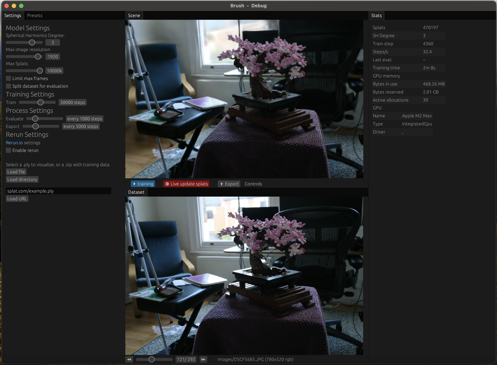
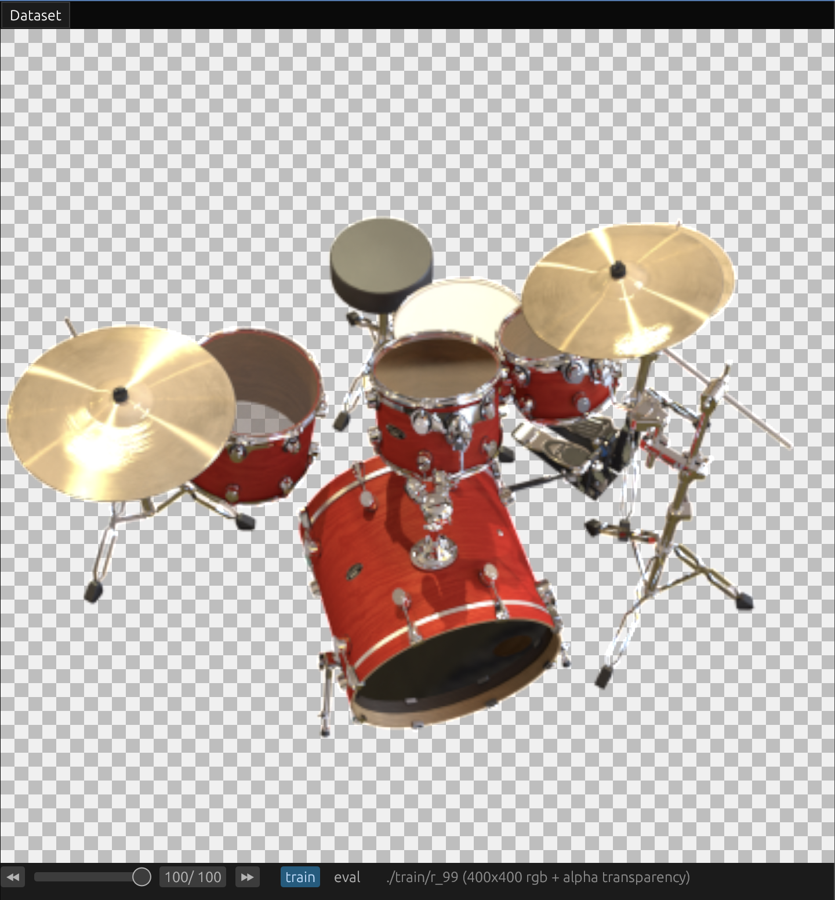
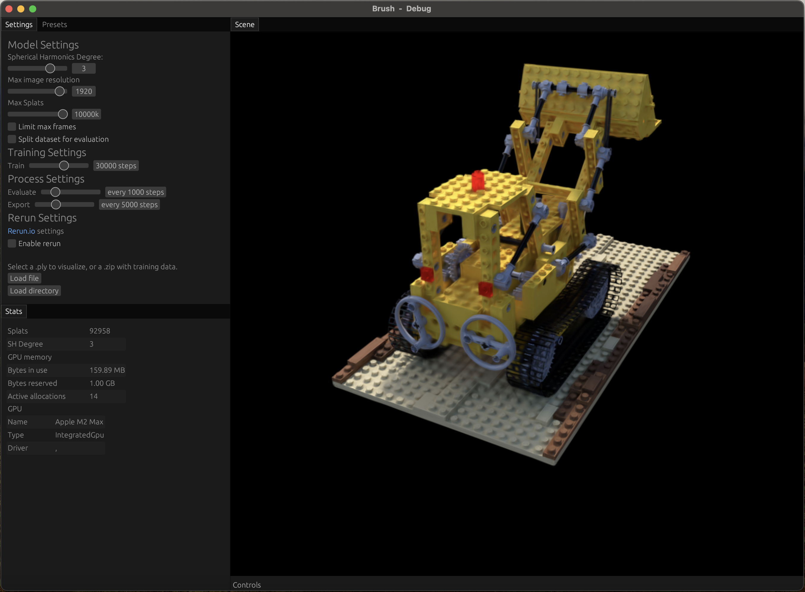

# 2.3 UI Overview

This page details the various panels within the Brush Graphical User Interface (UI). Understanding these panels is key to configuring, running, and monitoring the 3D reconstruction process or viewing results.

*Example layout showing rearranged UI panels (powered by egui_tiles).*

## Settings Panel

This panel contains options to load data and configure the model and training process. Changes to settings generally require reloading the dataset/model to take effect.

**Data Loading:**

*   **`Load file` Button:** Opens your system's file browser. Use this to select:
    *   A `.zip` file containing a dataset (Nerfstudio format with `transforms.json` and `images/`, or COLMAP format with `cameras.txt`, `images.txt`, `points3D.txt`, and `images/`).
    *   A pre-trained `.ply` Gaussian Splat file for viewing.
*   **URL Field & `Load URL` Button:** Paste a direct web link to a `.zip` dataset or `.ply` file and click `Load URL` to download and load it.

**Model Settings:** (Affect the structure and representation during *training*)

*   **`Spherical Harmonics Degree` (Slider: 0-4):** Controls the complexity of color representation.
    *   *Lower (0):* Simpler, view-independent color. Faster, less memory, less realistic lighting.
    *   *Higher (3-4):* More complex, view-dependent colors (reflections, shine). More realistic, more memory/computation, needs good data.
*   **`Max image resolution` (Slider: 32-2048):** Limits the resolution of input images used for training.
    *   *Lower:* Faster loading/training, less memory, may lose image detail.
    *   *Higher:* Preserves more detail, potentially better quality, more memory/time.
*   **`Max Splats` (Slider: 1M-10M):** Sets an approximate limit on the number of Gaussians generated during training.
    *   *Lower:* Limits complexity, less memory/rendering cost, may miss fine details.
    *   *Higher:* Allows more detail/complexity, significantly more memory, slower rendering/training steps.
*   **`Limit max frames` (Checkbox + Slider: 1-256 if checked):** Uses only a subset of input images/frames from the dataset for training. Useful for quick tests.
*   **`Split dataset for evaluation` (Checkbox + Slider: 1 out of 2-32 if checked):** Holds out some images for calculating quality metrics (PSNR/SSIM shown in Stats Panel) instead of using them for training. Helps monitor generalization.

**Training Settings:** (Control the optimization process)

*   **`Train` (Slider: 1-50000 steps):** Sets the total number of training iterations to run. More steps generally mean better quality up to a point of diminishing returns (default is 30,000).

**Process Settings:** (Control actions *during* training)

*   **`Evaluate` (Slider: every 1-5000 steps):** How often to calculate PSNR/SSIM on evaluation images (if split is enabled). Frequent evaluation gives more feedback but adds overhead.
*   **`Export` (Slider: every 1-15000 steps - *Native Desktop Only*):** Automatically saves a `.ply` checkpoint of the model this often during training. Useful for backups or observing progress.

**Rerun Settings:** (*Native Desktop Only*) - Configuration for logging to the Rerun.io visualizer.

> [!NOTE]
> Enabling these settings in the UI requires the `rerun-cli` tool to be installed separately. If it's not installed, visualizations will not appear even if logging is enabled here.

Enable and configure logging frequency for stats and splats if needed.

## Stats Panel

This panel displays real-time information about the loaded model and the ongoing training process.

*   **`Splats`:** Current count of Gaussian splats in the model. Changes during training (densification/pruning) or shows count for loaded PLY.
*   **`SH Degree`:** The Spherical Harmonics degree used by the current model (relevant during training).
*   **`Frames`:** Total frames loaded or current frame index (useful for animated PLY sequences).
*   **`Train step`:** Current training iteration number.
*   **`Steps/s`:** Estimated training speed (iterations per second).
*   **`Last eval:`:** Shows PSNR/SSIM results from the latest evaluation run (if evaluation is enabled during training). Higher is generally better. Watch this to see if training is still improving significantly.
*   **`Training time`:** Total time spent training so far.
*   **GPU Memory:** Displays `Bytes in use`, `Bytes reserved`, and `Active allocations` to monitor GPU memory usage.
*   **GPU Info (Native Only):** Shows details about the detected GPU and driver.

## Dataset Panel

This panel displays the input images from the loaded dataset. During training, it shows the ground truth image corresponding to the current camera pose being trained, allowing comparison with the rendered view in the Scene Panel.

*   You can scroll through the images using slider controls or buttons (e.g., `⏪`, `⏩`).
*   Options are available to switch between viewing `train` and `eval` split images if evaluation is enabled.

## Presets Panel

This panel is a tab within the Settings area that provides quick access to standard example datasets (like Mipnerf or Synthetic Blender scenes) or previously used local files/URLs.

> [!IMPORTANT]
> Clicking a preset provides a download link (for web datasets) or reveals the file path (for local presets). You must then **manually download** the dataset (if applicable) and **load the resulting file** (`.zip` or `.ply`) using the `Load file` or `Load URL` buttons in the Settings panel.

## Scene Panel

This is the main 3D viewport where the Gaussian Splatting model is rendered. You can navigate the scene using mouse and keyboard controls.

**Navigation Controls:**

*   **Orbit:** Left-click and drag.
*   **Look Around (FPS Style):** Right-click and drag, OR Left-click + `Spacebar` and drag.
*   **Pan:** Middle-click and drag, OR Left-click + `Ctrl` and drag.
*   **Zoom:** Scroll wheel.
*   **Fly Forward/Left/Back/Right:** `W`/`A`/`S`/`D` keys (or Arrow Keys Up/Left/Down/Right).
*   **Fly Up:** `E` key.
*   **Fly Down:** `Q` key.
*   **Roll Left:** `Z` key.
*   **Roll Right:** `C` key.
*   **Reset Roll:** `X` key.
*   **Move Faster:** Hold `Shift` while flying.

---

## Where to Go Next?

*   See how to use these panels in workflows: **[User Guide](user-guide.md)**.
*   Need definitions for terms? Check the **[Glossary](../supporting-materials/glossary.md)**.
*   Ran into issues? Look at the **[FAQ](../supporting-materials/faq.md)**. 