# 2.3 UI Overview

This page details the various panels within the Brush Graphical User Interface (UI). Understanding these panels is key to configuring, running, and monitoring the 3D reconstruction process or viewing results.

**Contents:**
- [Brush UI](#brush-ui)
- [Scene Panel](#scene-panel)
- [Dataset Panel](#dataset-panel)
- [Settings Panel](#settings-panel)
- [Stats Panel](#stats-panel)
- [Presets Panel](#presets-panel)

## Brush UI

Brush uses a flexible tiling system (powered by egui_tiles) that allows you to arrange panels to suit your workflow. Panels can be dragged, resized, and organized into tabs.

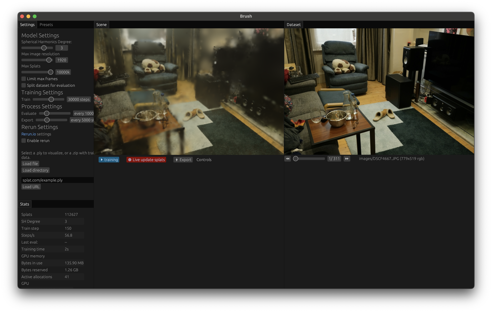 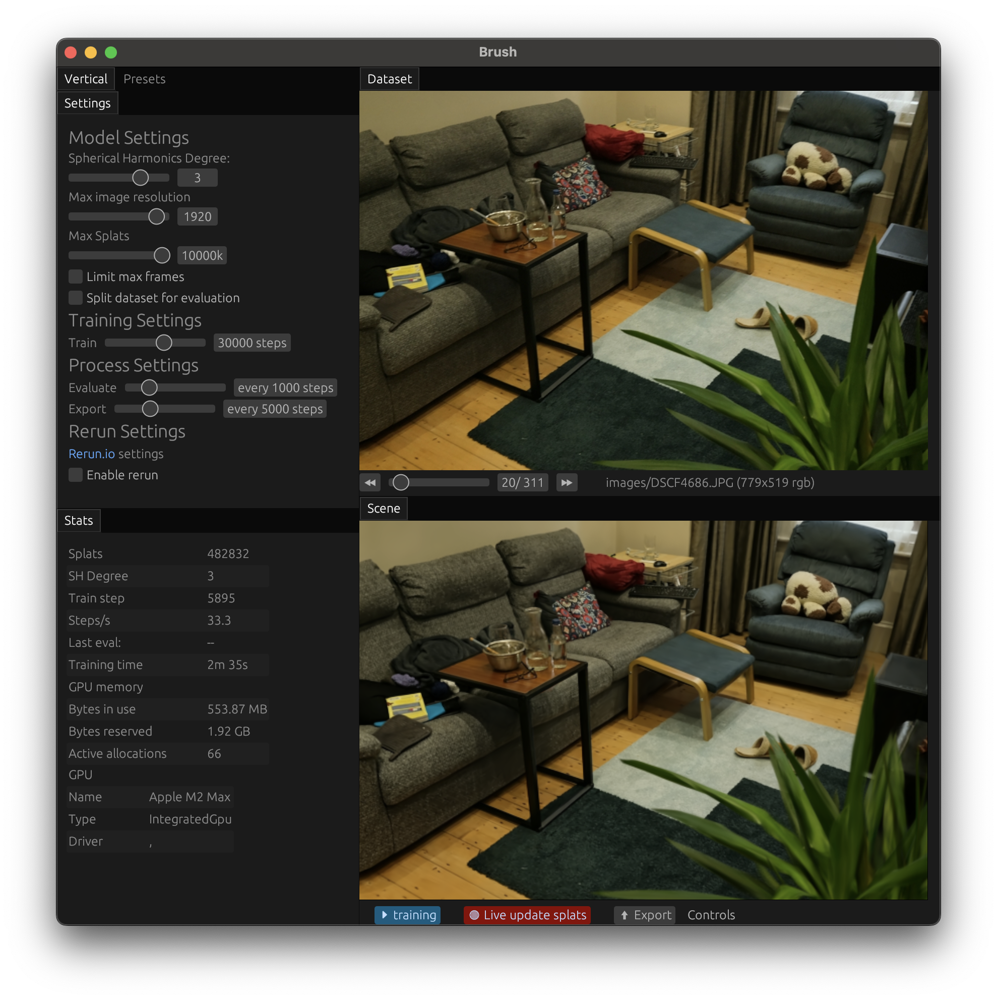
*Top: Default layout during training showing room scene reconstruction. Bottom: The same scene with panels rearranged to focus on different aspects of the workflow.*

## Scene Panel

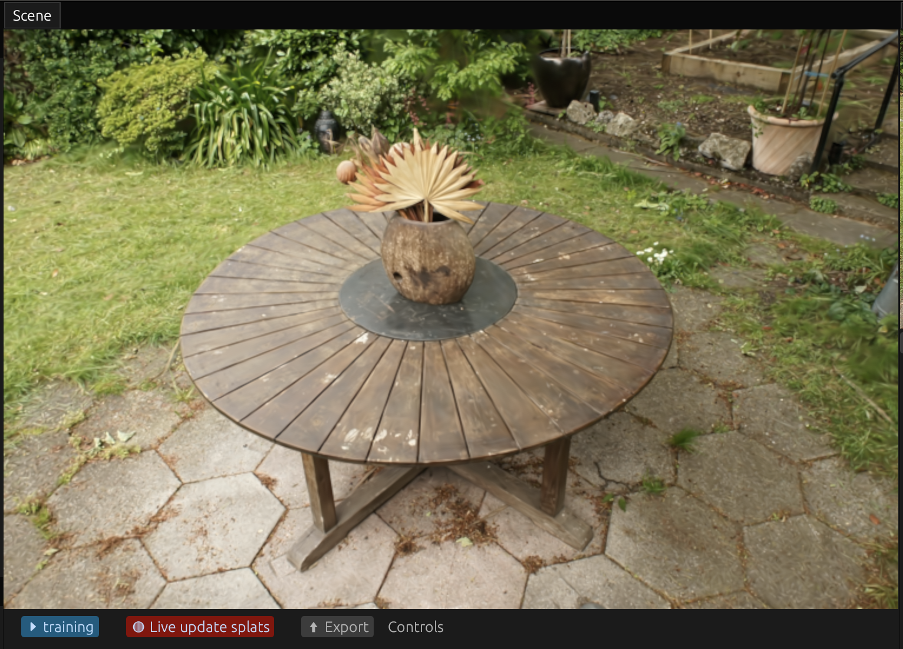

This is the main 3D viewport where the Gaussian Splatting model is rendered. You can navigate the scene using mouse and keyboard controls.

The Scene panel includes several control buttons:
*   **`▶ training`:** Start/stop training the current dataset. The button turns blue when training is active.
*   **`⟳ Live update splats`:** Toggle real-time updates of the scene during training. Disabling this can improve training performance while still allowing background processing.
*   **`⬆ Export`:** Save the current model state as a `.ply` file.
*   **`Controls`:** Show/hide the navigation controls overlay.

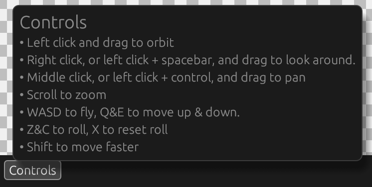

**Navigation Controls:**

*   **↺ Orbit:** Left click and drag to orbit
*   **👀 Look:** Right click, or left click + spacebar, and drag to look around
*   **↔ Pan:** Middle click, or left click + control, and drag to pan
*   **🔍 Zoom:** Scroll to zoom
*   **🎮 Movement:** WASD to fly, Q&E to move up & down
*   **↻ Roll:** Z&C to roll, X to reset roll
*   **⚡ Speed:** Hold Shift to move faster

## Dataset Panel

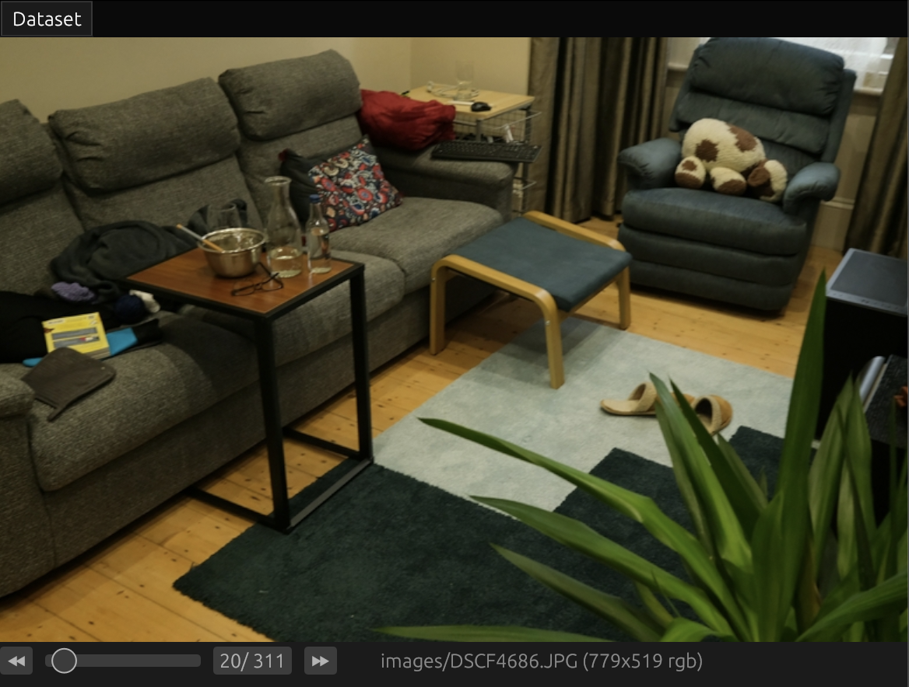

The Dataset panel shows all input images loaded from your dataset, along with their filenames and basic attributes like dimensions and color format. This provides a convenient way to browse through your source images and verify the dataset contents.

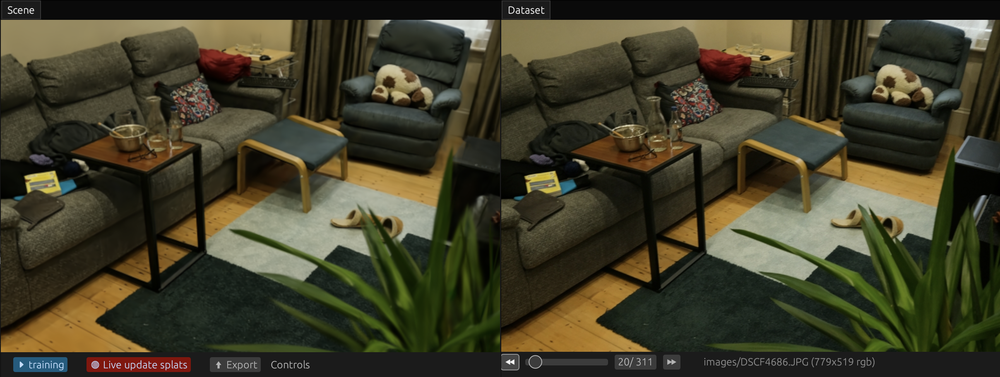

The Scene and Dataset panels are tightly integrated through camera poses. As you move the camera in the Scene panel, it automatically finds and selects the dataset image taken from the nearest matching camera position. Similarly, when you scroll through images in the Dataset panel, the Scene panel's camera smoothly moves to match that image's original capture position.

You can navigate through the dataset images using:
*   Slider controls to scrub through all images
*   Navigation buttons (`⏪`, `⏩`) to move one image at a time
*   Direct slider input to jump to a specific image number

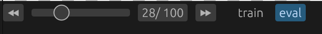

The `train` and `eval` buttons allow switching between training and evaluation image sets. These controls are only available when:
*   The loaded dataset includes pre-defined training and evaluation splits, or
*   You've enabled the "Split dataset for evaluation" option in the Settings panel, which automatically holds out some images for evaluation

## Settings Panel

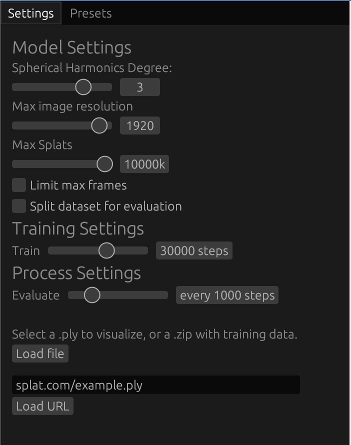

This panel contains options to load data and configure the model and training process. Some settings (like training steps and evaluation frequency) take effect immediately, while data loading settings (resolution, frame limits, dataset splits) require loading a new dataset to apply.

**Data Loading:**

*   **`Load file` Button:** Opens your system's file browser. Use this to select:
    *   A `.zip` file containing a dataset (Nerfstudio format with `transforms.json` and `images/`, or COLMAP format with `cameras.txt`, `images.txt`, `points3D.txt`, and `images/`).
    *   A pre-trained `.ply` Gaussian Splat file for viewing.
*   **URL Field & `Load URL` Button:** Paste a direct web link to a `.zip` dataset or `.ply` file and click `Load URL` to download and load it.
*   **`Load directory` Button (*Native Desktop Only*):** Load a dataset directly from an unzipped folder on your computer.

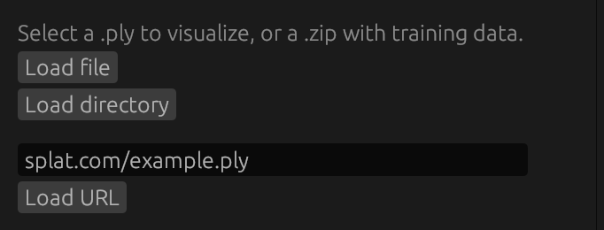

**Model Settings:** (Affect the structure and representation during *training*)

*   **`Spherical Harmonics Degree` (Slider: 0-4):** Controls the complexity of color representation.
    *   *Lower (0):* Simpler, view-independent color. Faster, less memory, less realistic lighting.
    *   *Higher (3-4):* More complex, view-dependent colors (reflections, shine). More realistic, more memory/computation, needs good data.
*   **`Max image resolution` (Slider: 32-2048):** Limits the resolution of input images used for training.
    *   *Lower:* Faster loading/training, less memory, may lose image detail.
    *   *Higher:* Preserves more detail, potentially better quality, more memory/time.
*   **`Max Splats` (Slider: 1M-10M):** Sets an approximate limit on the number of Gaussians generated during training.
    *   *Lower:* Limits complexity, less memory/rendering cost, may miss fine details.
    *   *Higher:* Allows more detail/complexity, significantly more memory, slower rendering/training steps.
*   **`Limit max frames` (Checkbox + Slider: 1-256 if checked):** Uses only a subset of input images/frames from the dataset for training. Useful for quick tests.
*   **`Split dataset for evaluation` (Checkbox + Slider: 1 out of 2-32 if checked):** Holds out some images for calculating quality metrics (PSNR/SSIM shown in Stats Panel) instead of using them for training. Helps monitor generalization.

**Training Settings:** (Control the optimization process)

*   **`Train` (Slider: 1-50000 steps):** Sets the total number of training iterations to run. More steps generally mean better quality up to a point of diminishing returns (default is 30,000).

**Process Settings:** (Control actions *during* training)

*   **`Evaluate` (Slider: every 1-5000 steps):** How often to calculate PSNR/SSIM on evaluation images (if split is enabled). Frequent evaluation gives more feedback but adds overhead.
*   **`Export` (Slider: every 1-15000 steps - *Native Desktop Only*):** Automatically saves a `.ply` checkpoint of the model this often during training. Useful for backups or observing progress.

**Rerun Settings:** (*Native Desktop Only*) - Configuration for logging to the Rerun.io visualizer.

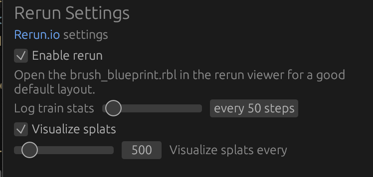

> [!NOTE]
> Enabling these settings in the UI requires the `rerun-cli` tool to be installed separately. If it's not installed, visualizations will not appear even if logging is enabled here.

Enable and configure logging frequency for stats and splats if needed.

## Stats Panel

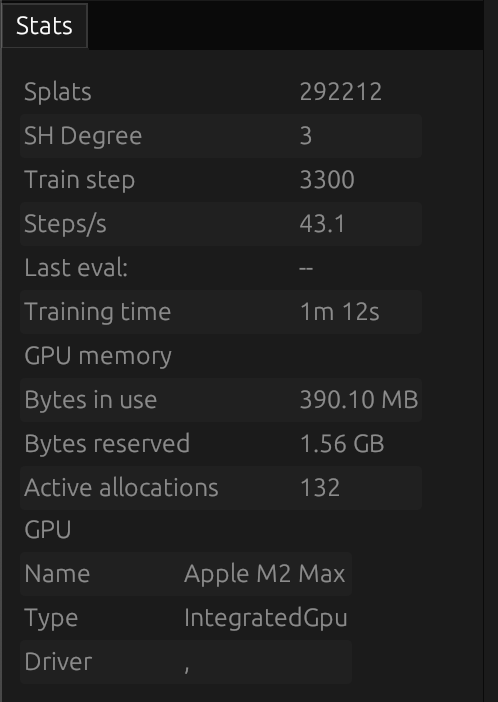

This panel displays real-time information about the loaded model and the ongoing training process.

*   **`Splats`:** Current count of Gaussian splats in the model. Changes during training (densification/pruning) or shows count for loaded PLY.
*   **`SH Degree`:** The Spherical Harmonics degree used by the current model (relevant during training).
*   **`Frames`:** (Shown for animated PLY sequences) Current frame number being displayed.
*   **`Train step`:** (Shown during training) Current training iteration number.
*   **`Steps/s`:** (Shown during training) Estimated training speed (iterations per second).
*   **`Last eval:`:** (Shown when evaluation is enabled) Shows PSNR/SSIM results from the latest evaluation run. Higher values generally indicate better quality. Watch this to see if training is still improving significantly.
*   **`Training time`:** (Shown during training) Total time spent training so far.
*   **GPU Memory:**
    *   **`Bytes in use`:** Current GPU memory actively being used.
    *   **`Bytes reserved`:** Total GPU memory allocated for potential use.
    *   **`Active allocations`:** Number of active memory allocations.
*   **GPU Info (Native Desktop Only):**
    *   **`Name`:** GPU model name.
    *   **`Type`:** GPU architecture type.
    *   **`Driver`:** GPU driver information.

## Presets Panel

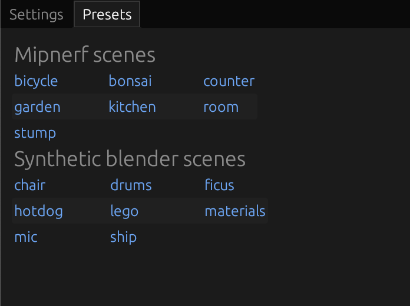

This panel provides direct download links to standard example datasets, organized into two categories:
- Mipnerf scenes (bicycle, bonsai, counter, etc.)
- Synthetic Blender scenes (chair, drums, ficus, etc.)

Each link opens in a new browser tab to download the dataset. After downloading, use the `Load file` or `Load URL` buttons in the Settings panel to load the dataset into Brush.

---

## Where to Go Next?

*   See how to use these panels in workflows: [User Guide](user-guide.md).
*   Need definitions for terms? Check the [Glossary](../supporting-materials/glossary.md).
*   Ran into issues? Look at the [FAQ](../supporting-materials/faq.md).
*   Want to contribute? See the [Developer Guide](developer-guide.md).