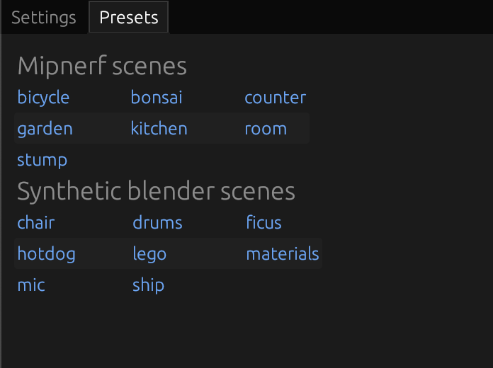
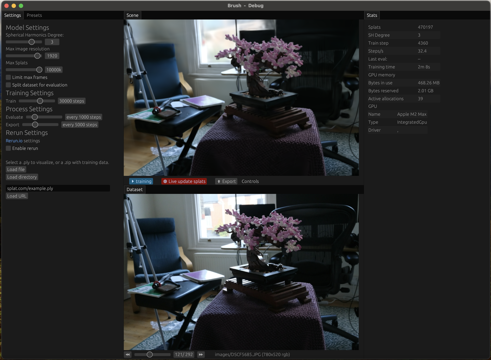

# 2.1. User Guide

This guide helps end-users install and use Brush.


*The main interface of the Brush desktop application.* 

**Quick Start:** Want to see Brush in action right away? Try the **[Live Web Demo](https://arthurbrussee.github.io/brush-demo)**. You can also view a pre-trained scene directly: **[Garden Scene Demo](https://arthurbrussee.github.io/brush-demo/?url=https://f005.backblazeb2.com/file/brush-splats-bakfiets/garden.ply&focal=1.0&zen=true)**.

## 2.1.1. Installation

Brush can be run on Desktop (macOS, Windows, Linux), Android, and the Web.

#### Desktop

*   **Pre-built Binaries (Recommended):** The easiest way to install Brush on the desktop is to download a pre-built binary for your operating system.
    *   Binaries for **Linux (x86_64)**, **macOS (Apple Silicon)**, and **Windows (x86_64)** are automatically built for tagged releases.
    *   > [!NOTE]
    >   Look for the `.tar.gz` or `.zip` files under the "Assets" section of the latest **[GitHub Release](https://github.com/ArthurBrussee/brush/releases)**.
*   **Build from Source:** If pre-built binaries are not available for your system or you want the latest development version, you can build from source. See the **[Developer Guide](developer-guide.md#222-building-the-project)** for instructions.

#### Web (WASM)

*   **Hosted Demo:** The easiest way to try Brush on the web is via the hosted demo:
    *   **[Live Web Demo Link](https://arthurbrussee.github.io/brush-demo)**
    *   Example viewing a pre-trained `.ply`: **[Garden Scene Demo](https://arthurbrussee.github.io/brush-demo/?url=https://f005.backblazeb2.com/file/brush-splats-bakfiets/garden.ply&focal=1.0&zen=true)**

    
    *Initial view of the hosted web demo.*

    
    *Web demo viewing the pre-trained Garden scene loaded via URL.*

*   > [!WARNING]
    >   **Training on Web:** As of early 2025, training new datasets directly within the web version may not work due to an issue in the underlying Burn library ([tracel-ai/burn#2901](https://github.com/tracel-ai/burn/issues/2901)). Viewing pre-trained `.ply` files should work correctly.
*   **Build from Source (for Development):** If you need to run a local development version or the hosted demo is unavailable:
    1.  Follow the **[Developer Guide](developer-guide.md#221-development-environment-setup)** to set up your environment, ensuring you have installed the `wasm32-unknown-unknown` target and `trunk`.
    2.  Build and serve the WASM application locally using Trunk:
        ```bash
        trunk serve --open
        ```
    3.  This will compile the application and open it in your default web browser.

*   **Android:**
    *   Refer to the specific instructions in `crates/brush-android/README.md` for building and running on Android.

## Preparing Datasets

Before you can view or train a scene, you need a dataset. Here are common ways to obtain one:

*   **Use the Presets:** The `Presets` panel in the Brush UI provides links to download standard test datasets (like Mipnerf scenes or Synthetic Blender scenes). Download the `.zip` file for the scene you want.
    
*   **Find Online Datasets:** Many Gaussian Splatting or NeRF datasets are available online. Search for `.ply` splat files or datasets in COLMAP or Nerfstudio formats.
*   **Process Your Own Data:** Use software like COLMAP to process your own images into the required format (camera poses + images).

Once you have a dataset (`.ply` file, `.zip` archive, or local folder), you can load it using one of the methods in Workflow 1 below.

## 2.1.2. Basic Workflows (Step-by-Step)

This section outlines common tasks using both the Graphical User Interface (UI) and the Command Line Interface (CLI).

### Workflow 1: Loading Data

You need to load either a pre-trained `.ply` splat file for viewing or a dataset for training. See "Preparing Datasets" above for how to obtain data.


#### Using the UI

1.  **Navigate to the Settings panel.** (See Panel description below)
    
2.  **Choose your loading method (assuming you have the data ready):**
    *   **Option A: Load Local File:**
        *   Click the `Load file` button.
        *   Use your system's file browser to select either:
            *   A pre-trained Gaussian Splat `.ply` file.
            *   A `.zip` archive containing a dataset (COLMAP or Nerfstudio format) you downloaded.
            *   _(Native Desktop Only)_ A folder containing an unzipped dataset (COLMAP or Nerfstudio format).
    *   **Option B: Load from URL:**
        *   Paste a direct web link to a `.ply` file or a `.zip` dataset into the URL field.
        *   Click the `Load URL` button.
    *   **(Finding Data Source) Option C: Use a Preset Link:**
        *   Click the `Presets` tab (next to `Settings`).
        *   Click on one of the listed scenes (e.g., `garden`, `stump`, `lego`). This opens a link to **download** the dataset `.zip` file.
        *   Once downloaded, use **Option A** (Load Local File) to load the `.zip` file.
3.  **Monitor Loading:** The `Stats` panel will update as the data is loaded. For large datasets, this might take some time.

#### Using the CLI

The `brush_app` executable handles loading as part of other commands (like viewing or training).

1.  **Viewing a `.ply` file:**
    ```bash
    ./target/release/brush_app --with-viewer /path/to/your/splat.ply
    ```
2.  **Training from a local dataset folder (COLMAP/Nerfstudio):**
    ```bash
    ./target/release/brush_app --with-viewer /path/to/your/dataset_folder
    ```
3.  **Training from a URL (.zip dataset):**
    ```bash
    ./target/release/brush_app --with-viewer https://example.com/path/to/dataset.zip
    ```
    *(Replace paths and URL with your actual data sources)*

### Workflow 2: Running 3D Reconstruction (Training)

This workflow assumes you have loaded a dataset suitable for training (not a pre-trained `.ply` file).


#### Using the UI

1.  **Configure Settings (Optional but Recommended):**
    *   In the **Settings** panel, adjust parameters like `Spherical Harmonics Degree`, `Max image resolution`, `Max Splats`, and the total number of `Train` steps according to your needs and hardware capabilities.
    *   Consider enabling `Split dataset for evaluation` to monitor quality metrics (PSNR/SSIM) during training.
    *   _(Native Desktop Only)_ Adjust `Export` frequency if you want automatic `.ply` checkpoints saved during training.
2.  **Start Training:**
    *   Ensure the desired number of steps is set in the `Train` slider.
    *   _(Implicit Start)_ Loading a dataset suitable for training often automatically starts the process based on the `Train` steps setting. If not, look for a dedicated "Start Training" button if one exists (UI may vary).
3.  **Monitor Progress:**
    *   The **Scene** panel will update visually, showing the splats refining over time (ensure `Live update splats` is checked if available).
    *   The **Stats** panel shows the current `Train step`, `Steps/s`, GPU usage, and evaluation metrics (`Last eval:`).
    *   The **Dataset** panel (if open) might show comparisons between rendered views and ground truth images.
    
4.  **Stopping Training:** Training stops automatically when the target number of `Train` steps is reached. You can often stop it manually via a button in the UI (e.g., near the training progress indicator).

#### Using the CLI

1.  **Run `brush_app` pointing to your dataset:**
    ```bash
    # Example with common options
    ./target/release/brush_app --with-viewer data/colmap_dataset --total-steps 15000 --export-every 5000 --export-path ./output/lego_train
    ```
2.  **Specify Parameters:** Add command-line arguments to override default settings (see `brush_app --help` for all options):
    *   `--total-steps <N>`: Set the number of training iterations.
    *   `--export-every <N>`: Save checkpoints every N steps.
    *   `--export-path <PATH>`: Directory for checkpoints.
    *   `--sh-degree <0-3>`: Set Spherical Harmonics degree.
    *   `--max-image-res <N>`: Limit image resolution.
    *   *(Many more options available)*
3.  **Monitor Progress:** Observe the log output in your terminal. If using `--with-viewer`, the UI will also show progress.
4.  **Stopping Training:** Press `Ctrl+C` in the terminal where `brush_app` is running.

### Workflow 3: Viewing the Scene

This applies whether you loaded a pre-trained `.ply` or after/during training a dataset.


#### Using the UI

1.  **Focus the Scene Panel:** Ensure the Scene panel is visible.
2.  **Navigate:** Use the mouse and keyboard controls detailed in the **[Scene Panel Navigation Controls](#scene-panel)** section below.
    

#### Using the CLI

1.  **View a specific `.ply`:**
    ```bash
    ./target/release/brush_app --with-viewer /path/to/your/splat.ply
    ```
2.  **View during training:** If you started training with `--with-viewer`, the UI will appear alongside the CLI process, allowing you to navigate the scene as it trains.

### Workflow 4: Exporting Results

Saving the trained Gaussian Splat model as a `.ply` file.

#### Using the UI

1.  **Automatic Export (During Training - Native Desktop Only):** If you set the `Export` slider in the **Settings** panel, `.ply` files will be saved automatically to a default location or specified path at the set frequency.
2.  **Manual Export (End of Training/Viewing):**
    *   While viewing a scene (either loaded or after training), click the `⬆ Export` button located at the bottom of the **Scene** panel.
    *   Use the system file browser that appears to choose a location and filename for the exported `.ply` file.

#### Using the CLI

1.  **Automatic Export (During Training):** Use the `--export-every <N>` and `--export-path <PATH>` arguments when starting training:
    ```bash
    ./target/release/brush_app data/dataset --total-steps 30000 --export-every 5000 --export-path ./checkpoints
    ```
2.  **Export at End of Training:** The final state is typically saved automatically at the end of the specified `--total-steps` to the `--export-path` directory (e.g., `./checkpoints/export_30000.ply`).

### Workflow 5: Using the Command Line Interface (`brush_app`)

The `brush_app` executable (found in `target/release/` or `target/debug/` after building) provides a command-line interface for core operations. You can run it directly from your terminal in the project's root directory.

Run `./target/release/brush_app --help` to see all available options.

**Common Use Cases:**

1.  **Viewing an Existing `.ply` Splat File:**
    ```bash
    # Assumes export_0.ply exists in the current directory
    ./target/release/brush_app --with-viewer ./export_0.ply
    ```
    *   This loads the specified `.ply` file.
    *   `--with-viewer` launches the interactive UI alongside the CLI process, allowing you to see the loaded splats.

2.  **Starting Training from a Dataset (e.g., COLMAP):**
    ```bash
    # Assumes your COLMAP data is in the 'data/colmap_dataset' directory
    ./target/release/brush_app --with-viewer data/colmap_dataset --total-steps 10000 --export-every 2000 --export-path ./output/my_train
    ```
    *   `data/colmap_dataset`: Path to the directory containing COLMAP output (`cameras.txt`, `images.txt`, `points3D.txt`, and an `images/` subdirectory).
    *   `--with-viewer`: (Optional) Shows the training progress visually.
    *   `--total-steps 10000`: Trains for 10,000 iterations (default is 30,000).
    *   `--export-every 2000`: Saves a `.ply` file every 2000 iterations.
    *   `--export-path ./output/my_train`: Specifies the directory to save exported `.ply` files.

3.  **Starting Training from a Dataset URL (Web Demo Style):**
    ```bash
    # Example URL (replace with actual URL to a zipped dataset)
    ./target/release/brush_app --with-viewer https://example.com/path/to/dataset.zip
    ```
    *   Downloads and extracts the dataset from the URL before starting training.

4.  **Adjusting Training Parameters:**
    ```bash
    ./target/release/brush_app data/nerfstudio_dataset --sh-degree 1 --lr-mean 1e-4 --refine-every 100
    ```
    *   `--sh-degree 1`: Use a lower SH degree (less view-dependent color).
    *   `--lr-mean 1e-4`: Set a specific initial learning rate for Gaussian means.
    *   `--refine-every 100`: Refine (densify/prune) Gaussians more frequently.

Refer to the `--help` output for the full list of detailed configuration options.

## 2.1.3. Hardware & Software Requirements

*   **Operating Systems:**
    *   Desktop: macOS, Windows, Linux
    *   Mobile: Android
    *   Web: Browsers supporting WebGPU
*   **CPU/RAM:** While specific minimums aren't defined, a modern multi-core CPU (e.g., Intel Core i5/i7, AMD Ryzen 5/7, or Apple Silicon M1/M2/M3 series or newer) and at least 16GB of RAM are recommended for a smooth experience, especially during training. More complex datasets will benefit from more RAM (32GB+).
*   **GPU:**
    *   Requires a GPU with good driver support for one of the modern graphics APIs used by `wgpu`:
        *   **Metal:** On macOS (including Apple Silicon M-series chips) and iOS.
        *   **Vulkan:** On Linux, Android, and Windows.
        *   **DirectX 12:** On Windows.
    *   This includes most modern GPUs from Nvidia, AMD, Intel, Apple (M-series), and mobile vendors (Qualcomm Adreno, ARM Mali, etc.) on their respective compatible operating systems.
    *   **CUDA is NOT required.**
*   **Web Browsers:**
    *   Requires a recent version of a browser supporting WebGPU.
    *   > [!IMPORTANT]
    *   >   Chrome 131+ is recommended as of early 2025. Firefox/Safari support may vary. Check [Can I use WebGPU?](https://caniuse.com/webgpu).

#### Direct URL Loading (Web Demo)

You can link directly to the web demo and have it automatically load a `.ply` file from a URL by appending query parameters:

*   `?url=<URL_TO_PLY_FILE>`: Specifies the `.ply` file to load.
*   `?focal=<FLOAT>`: (Optional) Sets an initial focal length override.
*   `?zen=true`: (Optional) Launches in "Zen Mode" with UI panels minimized.

**Example:**
`https://arthurbrussee.github.io/brush-demo/?url=https://f005.backblazeb2.com/file/brush-splats-bakfiets/garden.ply&focal=1.0&zen=true`


*Brush web demo loading the garden scene directly from a URL with Zen mode enabled.* 

## 2.1.4. Understanding the UI Panels

The Brush UI is composed of several panels. Here's a breakdown of the key ones involved in loading, training, and viewing:


*Example layout showing rearranged UI panels (powered by egui_tiles).*

#### Settings Panel


This panel contains options to load data and configure the model and training process. Changes to settings generally require reloading the dataset/model to take effect.

**Data Loading:**

*   **`Load file` Button:** Opens your system's file browser. Use this to select:
    *   A `.zip` file containing a dataset (Nerfstudio format with `transforms.json` and `images/`, or COLMAP format with `cameras.txt`, `images.txt`, `points3D.txt`, and `images/`).
    *   A pre-trained `.ply` Gaussian Splat file for viewing.
*   **URL Field & `Load URL` Button:** Paste a direct web link to a `.zip` dataset or `.ply` file and click `Load URL` to download and load it.

**Model Settings:** (Affect the structure and representation)

*   **`Spherical Harmonics Degree` (Slider: 0-4):** Controls the complexity of color representation.
    *   *Lower (0):* Simpler, view-independent color. Faster, less memory, less realistic lighting.
    *   *Higher (3-4):* More complex, view-dependent colors (reflections, shine). More realistic, more memory/computation, needs good data.
*   **`Max image resolution` (Slider: 32-2048):** Limits the resolution of input images used for training.
    *   *Lower:* Faster loading/training, less memory, may lose image detail.
    *   *Higher:* Preserves more detail, potentially better quality, more memory/time.
*   **`Max Splats` (Slider: 1M-10M):** Sets an approximate limit on the number of Gaussians.
    *   *Lower:* Limits complexity, less memory/rendering cost, may miss fine details.
    *   *Higher:* Allows more detail/complexity, significantly more memory, slower rendering/training steps.
*   **`Limit max frames` (Checkbox + Slider: 1-256 if checked):** Uses only a subset of input images/frames from the dataset. Useful for quick tests.
*   **`Split dataset for evaluation` (Checkbox + Slider: 1 out of 2-32 if checked):** Holds out some images for calculating quality metrics (PSNR/SSIM shown in Stats Panel) instead of using them for training. Helps monitor generalization.

**Training Settings:** (Control the optimization process)

*   **`Train` (Slider: 1-50000 steps):** Sets the total number of training iterations to run. More steps generally mean better quality up to a point of diminishing returns.

**Process Settings:** (Control actions *during* training)

*   **`Evaluate` (Slider: every 1-5000 steps):** How often to calculate PSNR/SSIM on evaluation images (if split is enabled). Frequent evaluation gives more feedback but adds overhead.
*   **`Export` (Slider: every 1-15000 steps - *Native Desktop Only*):** Automatically saves a `.ply` checkpoint of the model this often during training. Useful for backups or observing progress.

**Rerun Settings:** (*Native Desktop Only*) - Configuration for logging to the Rerun.io visualizer. Enable and configure logging frequency for stats and splats if needed.

#### Stats Panel


This panel displays real-time information about the loaded model and the ongoing training process.

*   **`Splats`:** Current count of Gaussian splats in the model. Changes during training (densification/pruning).
*   **`SH Degree`:** The Spherical Harmonics degree used by the current model.
*   **`Frames`:** (If applicable) Total frames loaded or current frame index.
*   **`Train step`:** Current training iteration number.
*   **`Steps/s`:** Estimated training speed (iterations per second).
*   **`Last eval:`:** Shows PSNR/SSIM results from the latest evaluation run. Higher is generally better. Watch this to see if training is still improving significantly.
*   **`Training time`:** Total time spent training so far.
*   **GPU Memory:** Displays `Bytes in use`, `Bytes reserved`, and `Active allocations` to monitor GPU memory usage.
*   **GPU Info (Native Only):** Shows details about the detected GPU and driver.

#### Dataset Panel


This panel typically shows the input images from the loaded dataset. 

*   You can often scroll through the images using slider controls or buttons (e.g., `⏪`, `⏩`).
*   During training, it may display the current training image alongside the rendered view for comparison.
*   Options might be available to switch between viewing `train` and `eval` split images if evaluation is enabled.

#### Presets Panel


This panel (often a tab within the Settings area) provides quick access to load standard example datasets (like Mipnerf or Synthetic Blender scenes) or previously used local files/URLs.

#### Scene Panel


This is the main 3D viewport where the Gaussian Splatting model is rendered. You can navigate the scene using mouse controls (e.g., click-and-drag to orbit, scroll wheel to zoom). The specific controls might be configurable or follow standard conventions.

> [!TIP]
> **Navigation Controls:**

*   **Orbit:** Left-click and drag.
*   **Look Around (FPS Style):** Right-click and drag, OR Left-click + `Spacebar` and drag.
*   **Pan:** Middle-click and drag, OR Left-click + `Ctrl` and drag.
*   **Zoom:** Scroll wheel.
*   **Fly Forward/Left/Back/Right:** `W`/`A`/`S`/`D` keys (or Arrow Keys Up/Left/Down/Right).
*   **Fly Up:** `E` key.
*   **Fly Down:** `Q` key.
*   **Roll Left:** `Z` key.
*   **Roll Right:** `C` key.
*   **Reset Roll:** `X` key.
*   **Move Faster:** Hold `Shift` while flying.

Understanding how Settings affect the Stats (e.g., increasing `Max Splats` increases memory usage) is key to tuning the process. Training doesn't have a defined "end"; it's stopped when the desired number of steps is reached, quality metrics plateau, or the visual result is satisfactory.

---

## Where to Go Next?

*   Want to build the project yourself? See the **[Developer Guide](developer-guide.md)**.
*   Need definitions for terms? Check the **[Glossary](../supporting-materials/glossary.md)**.
*   Ran into issues? Look at the **[FAQ](../supporting-materials/faq.md)**. 