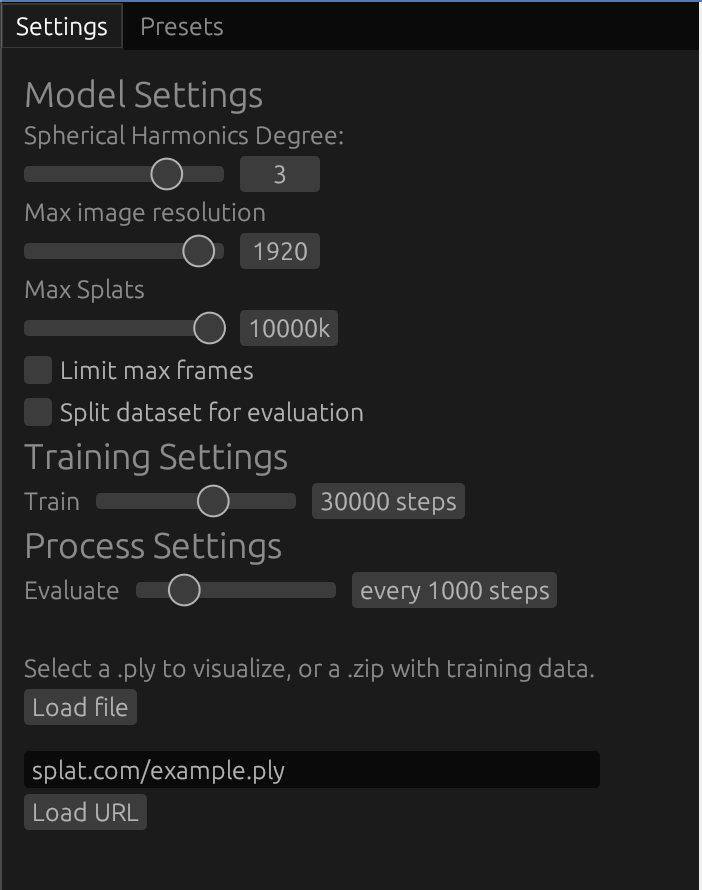

# 2.1. User Guide

This guide helps end-users install and use Brush.


*The main interface of the Brush desktop application.* 

**Quick Start:** Want to see Brush in action right away? Try the **[Live Web Demo](https://arthurbrussee.github.io/brush-demo)**. You can also view a pre-trained scene directly: **[Garden Scene Demo](https://arthurbrussee.github.io/brush-demo/?url=https://f005.backblazeb2.com/file/brush-splats-bakfiets/garden.ply&focal=1.0&zen=true)**.

## 2.1.1. Installation

Brush can be run on Desktop (macOS, Windows, Linux), Android, and the Web.

#### Desktop

*   **Pre-built Binaries (Recommended):** The easiest way to install Brush on the desktop is to download a pre-built binary for your operating system.
    *   Binaries for **Linux (x86_64)**, **macOS (Apple Silicon)**, and **Windows (x86_64)** are automatically built for tagged releases.
    *   Go to the **[GitHub Releases page](https://github.com/ArthurBrussee/brush/releases)** (e.g., [v0.2.0](https://github.com/ArthurBrussee/brush/releases/tag/0.2.0)).
    *   Find the latest release tag.
    *   Under the "Assets" section, download the appropriate archive (`.tar.gz` for Linux/macOS, `.zip` for Windows) for your system.
    *   Extract the archive. The `brush_app` (or `brush_app.exe`) executable will be inside.
*   **Build from Source:** If pre-built binaries are not available for your system or you want the latest development version, you can build from source. See the **[Developer Guide](developer-guide.md#222-building-the-project)** for instructions.

#### Web (WASM)

*   **Hosted Demo:** The easiest way to try Brush on the web is via the hosted demo:
    *   **[Live Web Demo Link](https://arthurbrussee.github.io/brush-demo)**
    *   Example viewing a pre-trained `.ply`: **[Garden Scene Demo](https://arthurbrussee.github.io/brush-demo/?url=https://f005.backblazeb2.com/file/brush-splats-bakfiets/garden.ply&focal=1.0&zen=true)**
*   **Important Note (Training on Web):** As of early 2025, training new datasets directly within the web version may not work due to an issue in the underlying Burn library ([tracel-ai/burn#2901](https://github.com/tracel-ai/burn/issues/2901)). Viewing pre-trained `.ply` files should work correctly.
*   **Build from Source (for Development):** If you need to run a local development version or the hosted demo is unavailable:
    1.  Follow the **[Developer Guide](developer-guide.md#221-development-environment-setup)** to set up your environment, ensuring you have installed the `wasm32-unknown-unknown` target and `trunk`.
    2.  Build and serve the WASM application locally using Trunk:
        ```bash
        trunk serve --open
        ```
    3.  This will compile the application and open it in your default web browser.

*   **Android:**
    *   Refer to the specific instructions in `crates/brush-android/README.md` for building and running on Android.

## 2.1.2. Basic Workflows (Step-by-Step)

*(TODO: Detail the core user workflows with screenshots/GIFs for the UI. Add specific commands and options for the CLI.)*

*   **Workflow 1: Loading a Dataset:**
    *   **UI:** *(Describe steps, e.g., File -> Open, select COLMAP/Nerfstudio folder or Zip file for web)*
    *   **CLI:** *(Command: `brush load ...`?)*
*   **Workflow 2: Running 3D Reconstruction:**
    *   **UI:** *(Describe steps, e.g., click Train button, view progress)*
    *   **CLI:** *(Command: `brush train ...`?)*
*   **Workflow 3: Viewing the Scene:**
    *   **UI:** *(Describe navigation controls: orbit, flythrough)*
    *   **CLI:** *(View existing splat: `brush view <file.ply>`? Use `--with-viewer` flag during other operations?)*
*   **Workflow 4: Exporting Results:**
    *   **UI:** *(Describe steps, e.g., File -> Export Splat)*
    *   **CLI:** *(Command: `brush export ...`?)*
*   **Workflow 5: Using the Command Line Interface (`brush_app`)**

*(TODO: Verify these commands and add example output snippets.)*

The `brush_app` executable (found in `target/release/` or `target/debug/` after building) provides a command-line interface for core operations. You can run it directly from your terminal in the project's root directory.

Run `./target/release/brush_app --help` to see all available options.

**Common Use Cases:**

1.  **Viewing an Existing `.ply` Splat File:**
    ```bash
    # Assumes export_0.ply exists in the current directory
    ./target/release/brush_app --with-viewer ./export_0.ply
    ```
    *   This loads the specified `.ply` file.
    *   `--with-viewer` launches the interactive UI alongside the CLI process, allowing you to see the loaded splats.

2.  **Starting Training from a Dataset (e.g., COLMAP):**
    ```bash
    # Assumes your COLMAP data is in the 'data/colmap_dataset' directory
    ./target/release/brush_app --with-viewer data/colmap_dataset --total-steps 10000 --export-every 2000 --export-path ./output/my_train
    ```
    *   `data/colmap_dataset`: Path to the directory containing COLMAP output (`cameras.txt`, `images.txt`, `points3D.txt`, and an `images/` subdirectory).
    *   `--with-viewer`: (Optional) Shows the training progress visually.
    *   `--total-steps 10000`: Trains for 10,000 iterations (default is 30,000).
    *   `--export-every 2000`: Saves a `.ply` file every 2000 iterations.
    *   `--export-path ./output/my_train`: Specifies the directory to save exported `.ply` files.

3.  **Starting Training from a Dataset URL (Web Demo Style):**
    ```bash
    # Example URL (replace with actual URL to a zipped dataset)
    ./target/release/brush_app --with-viewer https://example.com/path/to/dataset.zip
    ```
    *   Downloads and extracts the dataset from the URL before starting training.

4.  **Adjusting Training Parameters:**
    ```bash
    ./target/release/brush_app data/nerfstudio_dataset --sh-degree 1 --lr-mean 1e-4 --refine-every 100
    ```
    *   `--sh-degree 1`: Use a lower SH degree (less view-dependent color).
    *   `--lr-mean 1e-4`: Set a specific initial learning rate for Gaussian means.
    *   `--refine-every 100`: Refine (densify/prune) Gaussians more frequently.

Refer to the `--help` output for the full list of detailed configuration options.

## 2.1.3. Hardware & Software Requirements

*   **Operating Systems:**
    *   Desktop: macOS, Windows, Linux
    *   Mobile: Android
    *   Web: Browsers supporting WebGPU
*   **CPU/RAM:** *(TODO: Add general recommendations if available. Assume reasonable modern CPU/RAM.)*
*   **GPU:**
    *   Requires a GPU with good driver support for one of the modern graphics APIs used by `wgpu`:
        *   **Metal:** On macOS (including Apple Silicon M-series chips) and iOS.
        *   **Vulkan:** On Linux, Android, and Windows.
        *   **DirectX 12:** On Windows.
    *   This includes most modern GPUs from Nvidia, AMD, Intel, Apple (M-series), and mobile vendors (Qualcomm Adreno, ARM Mali, etc.) on their respective compatible operating systems.
    *   **CUDA is NOT required.**
*   **Web Browsers:**
    *   Requires a recent version of a browser supporting WebGPU.
    *   Chrome 131+ is recommended as of early 2025. Firefox/Safari support may vary.
    *   Check [Can I use WebGPU?](https://caniuse.com/webgpu).

### 2.1.4. Understanding the UI Panels

The Brush UI is composed of several panels. Here's a breakdown of the key ones involved in loading, training, and viewing:

#### Settings Panel



This panel contains options to load data and configure the model and training process. Changes to settings generally require reloading the dataset/model to take effect.

**Data Loading:**

*   **`Load file` Button:** Opens your system's file browser. Use this to select:
    *   A `.zip` file containing a dataset (Nerfstudio format with `transforms.json` and `images/`, or COLMAP format with `cameras.txt`, `images.txt`, `points3D.txt`, and `images/`).
    *   A pre-trained `.ply` Gaussian Splat file for viewing.
*   **URL Field & `Load URL` Button:** Paste a direct web link to a `.zip` dataset or `.ply` file and click `Load URL` to download and load it.

**Model Settings:** (Affect the structure and representation)

*   **`Spherical Harmonics Degree` (Slider: 0-4):** Controls the complexity of color representation.
    *   *Lower (0):* Simpler, view-independent color. Faster, less memory, less realistic lighting.
    *   *Higher (3-4):* More complex, view-dependent colors (reflections, shine). More realistic, more memory/computation, needs good data.
*   **`Max image resolution` (Slider: 32-2048):** Limits the resolution of input images used for training.
    *   *Lower:* Faster loading/training, less memory, may lose image detail.
    *   *Higher:* Preserves more detail, potentially better quality, more memory/time.
*   **`Max Splats` (Slider: 1M-10M):** Sets an approximate limit on the number of Gaussians.
    *   *Lower:* Limits complexity, less memory/rendering cost, may miss fine details.
    *   *Higher:* Allows more detail/complexity, significantly more memory, slower rendering/training steps.
*   **`Limit max frames` (Checkbox + Slider: 1-256 if checked):** Uses only a subset of input images/frames from the dataset. Useful for quick tests.
*   **`Split dataset for evaluation` (Checkbox + Slider: 1 out of 2-32 if checked):** Holds out some images for calculating quality metrics (PSNR/SSIM shown in Stats Panel) instead of using them for training. Helps monitor generalization.

**Training Settings:** (Control the optimization process)

*   **`Train` (Slider: 1-50000 steps):** Sets the total number of training iterations to run. More steps generally mean better quality up to a point of diminishing returns.

**Process Settings:** (Control actions *during* training)

*   **`Evaluate` (Slider: every 1-5000 steps):** How often to calculate PSNR/SSIM on evaluation images (if split is enabled). Frequent evaluation gives more feedback but adds overhead.
*   **`Export` (Slider: every 1-15000 steps - *Native Desktop Only*):** Automatically saves a `.ply` checkpoint of the model this often during training. Useful for backups or observing progress.

**Rerun Settings:** (*Native Desktop Only*) - Configuration for logging to the Rerun.io visualizer. Enable and configure logging frequency for stats and splats if needed.

#### Stats Panel


This panel displays real-time information about the loaded model and the ongoing training process.

*   **`Splats`:** Current count of Gaussian splats in the model. Changes during training (densification/pruning).
*   **`SH Degree`:** The Spherical Harmonics degree used by the current model.
*   **`Frames`:** (If applicable) Total frames loaded or current frame index.
*   **`Train step`:** Current training iteration number.
*   **`Steps/s`:** Estimated training speed (iterations per second).
*   **`Last eval:`:** Shows PSNR/SSIM results from the latest evaluation run. Higher is generally better. Watch this to see if training is still improving significantly.
*   **`Training time`:** Total time spent training so far.
*   **GPU Memory:** Displays `Bytes in use`, `Bytes reserved`, and `Active allocations` to monitor GPU memory usage.
*   **GPU Info (Native Only):** Shows details about the detected GPU and driver.

#### Presets Panel


This panel (often a tab within the Settings area) provides quick access to load standard example datasets (like Mipnerf or Synthetic Blender scenes) or previously used local files/URLs.

#### Scene Panel


This is the main 3D viewport where the Gaussian Splatting model is rendered. You can navigate the scene using mouse controls (e.g., click-and-drag to orbit, scroll wheel to zoom). The specific controls might be configurable or follow standard conventions.

**Navigation Controls:**

*   **Orbit:** Left-click and drag.
*   **Look Around (FPS Style):** Right-click and drag, OR Left-click + `Spacebar` and drag.
*   **Pan:** Middle-click and drag, OR Left-click + `Ctrl` and drag.
*   **Zoom:** Scroll wheel.
*   **Fly Forward/Left/Back/Right:** `W`/`A`/`S`/`D` keys (or Arrow Keys Up/Left/Down/Right).
*   **Fly Up:** `E` key.
*   **Fly Down:** `Q` key.
*   **Roll Left:** `Z` key.
*   **Roll Right:** `C` key.
*   **Reset Roll:** `X` key.
*   **Move Faster:** Hold `Shift` while flying.

Understanding how Settings affect the Stats (e.g., increasing `Max Splats` increases memory usage) is key to tuning the process. Training doesn't have a defined "end"; it's stopped when the desired number of steps is reached, quality metrics plateau, or the visual result is satisfactory.

---

## Where to Go Next?

*   Want to build the project yourself? See the **[Developer Guide](developer-guide.md)**.
*   Need definitions for terms? Check the **[Glossary](../supporting-materials/glossary.md)**.
*   Ran into issues? Look at the **[FAQ](../supporting-materials/faq.md)**. 