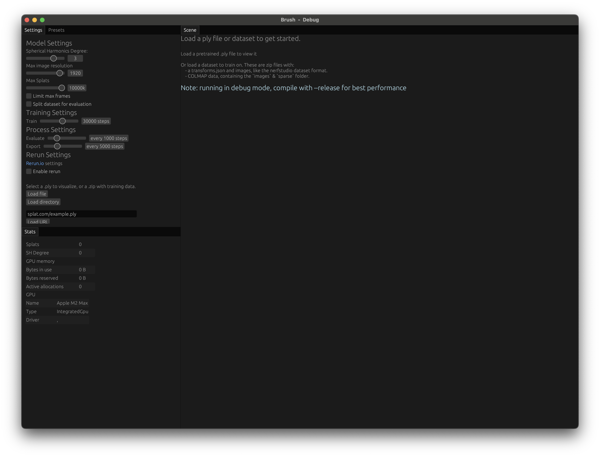

# Training a Scene

This guide walks through training a new 3D Gaussian Splatting scene from your own data using Brush.

> **Prerequisites:**
>
> *   The Brush application installed or available to run via CLI (see [Installing Brush](./installing-brush.md)).
> *   A dataset in a supported format (COLMAP directory, Nerfstudio JSON with images, or a `.zip` of either).

> **Warning: Web Training** ⚠️
> Training via the web browser interface is **not recommended** due to significantly lower performance and potential failures ([Burn #2901](https://github.com/tracel-ai/burn/issues/2901)). Use the desktop application or CLI for training.

## Core Workflow

1.  **Launch Brush:** Run the `brush_app` executable (or use `cargo run --bin brush_app --release` if built from source).
    *(The initial UI displays placeholder text and default settings)*
    

    *(The UI during training includes panels for settings, scene rendering, and dataset viewing)*
    

2.  **Load Your Dataset:**
    *   Use the **`Settings`** or **`Presets`** tab in the left-hand panel:
        *   **`Settings` Tab:**
            *   Click **`Load file`** to select a `.zip` archive or `.ply` file from your computer.
            *   Click **`Load directory`** (Desktop only) to select the root folder of your COLMAP or Nerfstudio dataset.
            *   Enter a URL to a `.zip` or `.ply` file in the text box and click **`Load URL`**.
        *   **`Presets` Tab:**
            *   This tab contains links to download example datasets (hosted on Google Drive).
            *   Clicking a preset name (e.g., `bicycle`, `lego`) will **open a download link in your browser**.
            *   You must first download the `.zip` file and then use the **`Load file`** button in the **`Settings`** tab to load it into Brush.
    *   Check the Scene panel for any error messages if loading fails.

3.  **(Optional) Adjust Settings:**
    *   Before or after loading data, you can tweak parameters in the **`Settings`** tab. These correspond to [CLI options](./cli-usage.md) as well.
    *   For a detailed explanation of all configuration parameters, refer to the [Configuration Options Reference](../reference/config-options.md).
        *   **Model Settings:** `Spherical Harmonics Degree`, `Max image resolution`, `Max Splats`.
        *   **Load Settings:** `Limit max frames`, `Split dataset for evaluation` (if checked, enables the `eval` tab in the Dataset panel).
        *   **Training Settings:** `Train ... steps` (sets the target number of training iterations).
        *   **Process Settings:** `Evaluate every ... steps`, `Export every ... steps` (enables automatic periodic export, see `## Exporting Results` below).
        *   **Rerun Settings** (Desktop only, requires `--features=rerun` build):
            *   This section controls logging data to the **Rerun Viewer**, a separate application used for detailed visualization. Brush itself does *not* gain extra UI panels; it sends data to the external viewer.
            *   `Enable rerun`: Must be checked to activate sending data to a running Rerun viewer.
            *   `Log train stats every`: Controls frequency of scalar logging (loss, iter/s, etc.) sent to Rerun. Set > 0 to enable.
            *   `Visualize splats every`: Controls frequency of logging the 3D splat point cloud to Rerun (can be performance-intensive). Set > 0 to enable.

    **Using Rerun for Detailed Visualization:**

    Rerun provides powerful, time-scrubbing visualization of the training process, but requires specific setup:

    1.  **Install Rerun Viewer:** Ensure you have installed the viewer using `cargo install rerun-cli`. (See [Installing Brush](./installing-brush.md)). The Python `rerun-sdk` is **not** needed.
    2.  **Build Brush with Feature:** Run Brush using the `--features=rerun` flag (e.g., `cargo run --bin brush_app --features=rerun`).
    3.  **Launch Rerun Viewer FIRST:** *Before* starting training in Brush, launch the Rerun Viewer application. The recommended way is to run the following command in your terminal (in the Brush project directory) before starting Brush:
        ```bash
        # The blueprint file is located in the project root directory.
        rerun ./brush_blueprint.rbl &
        ```
        This starts the viewer in the background (`&`) and loads the `brush_blueprint.rbl` file for the optimal panel layout. Alternatively, run `rerun` in a separate terminal and load the blueprint via the File menu.
    4.  **Enable in Brush UI:** Once Brush is running, go to `Settings -> Rerun Settings` and check `Enable rerun`. Also set `Log train stats every` and `Visualize splats every` to desired frequencies (e.g., 50 and 500).
    5.  **Start Training:** Load your dataset and click the `⏵ training` button.
    6.  **Check Rerun Window:** Data will start appearing in the separate Rerun Viewer window.
        *   **Platform Note:** Rerun visualization is only available in native desktop builds (Windows, macOS, Linux) and is disabled in web (WASM) builds.
        *   **Initial Delay:** Note that some panels (plots, evaluation stats) might take ~30 seconds or until the first evaluation cycle completes to populate fully.
        *   **Evaluation Data:** The blueprint layout works best if you enable **`Split dataset for evaluation`** in Brush's `Process Settings`, as many panels display evaluation-specific metrics and images.

    **Original Rerun Visualization Example:**
    <video src="https://github.com/user-attachments/assets/f679fec0-935d-4dd2-87e1-c301db9cdc2c" controls width="100%"></video>
    *Rerun viewer showing detailed training visualization for the LEGO dataset.*

## Monitoring Training

Once a dataset is loaded, training typically starts automatically in the background. You can monitor and control it using the UI panels:

*   **`Stats` Panel:** Displays the current training iteration number (`Train step`) compared to the total steps planned (`Train ... steps`), along with the current training speed (`Steps/s`). It also shows other statistics like total splat count and estimated GPU memory usage.
*   **`Scene` Panel Controls & View:** The area below the main 3D view provides crucial controls and feedback:
    *   `⏵ training` / `⏸ paused`: Click this button to **pause or resume** the background training process. Training automatically runs unless paused here.
    *   `🔴 Live update splats`: This toggle controls whether the 3D view updates with the latest splats from the training process. Disabling this can improve UI responsiveness but doesn't pause the actual training. It defaults to enabled.
    *   `⬆ Export`: Manually exports the *currently visible* splats (see `## Exporting Results` below).
    *   `Controls`: Shows camera control hints on hover.
    *   The **main view** shows the Gaussian splats. If `Live update splats` is enabled, this view updates periodically. Check here for "Loading..." or error messages overlayed on the view.
*   **`Dataset` Panel:**
    *   Displays the dataset image closest to the current camera pose in the `Scene` panel.
    *   **Interaction:** Moving the camera in the `Scene` panel will update the image shown here. Conversely, using the slider or `⏪`/`⏩` buttons in this panel to change the displayed image will **snap the `Scene` panel's camera** to that image's recorded pose.
    *   If `Split dataset for evaluation` was checked, an `eval` tab appears here displaying evaluation metrics (PSNR, SSIM, LPIPS) calculated periodically based on the `Evaluate every ... steps` setting.
*   **Pausing/Stopping:**
    *   **Pausing:** Use the `⏸ paused` button in the **`Scene`** panel controls.

## Exporting Results

Brush offers two ways to export the trained Gaussian splat data as `.ply` files:

*   **Manual Export (Current View):**
    *   While training or viewing, click the **`⬆ Export`** button located below the **`Scene`** panel.
    *   This opens a native "Save File" dialog.
    *   It saves the splat data *currently being displayed* in the Scene view.
*   **Automatic Periodic Export (Checkpoints):**
    *   Configure this in **`Settings -> Process Settings`** using the `Export every ... steps` slider (set > 0 to enable).
    *   Requires the desktop application.
    *   Saves checkpoint `.ply` files periodically during training.
    *   **Location:** Saves to the *current working directory* by default, or to the path specified by the `--export-path` CLI argument.
    *   **Naming:** Uses `export_{iter}.ply` by default, customizable via `--export-name`.

## Next Steps

*   Once training is complete (or stopped) and you have `.ply` files, **view the results** following the [Viewing Scenes](./viewing-scenes.md) guide.
*   To understand **command-line alternatives** for loading and training, see the [CLI Usage Guide](./cli-usage.md).
*   For technical details on the **algorithms involved**, explore the [Training and Rendering Pipeline](../development/training-and-rendering.md) documentation.
*   To learn about how the **user interface is built**, read the [UI Development Guide](../development/ui.md).