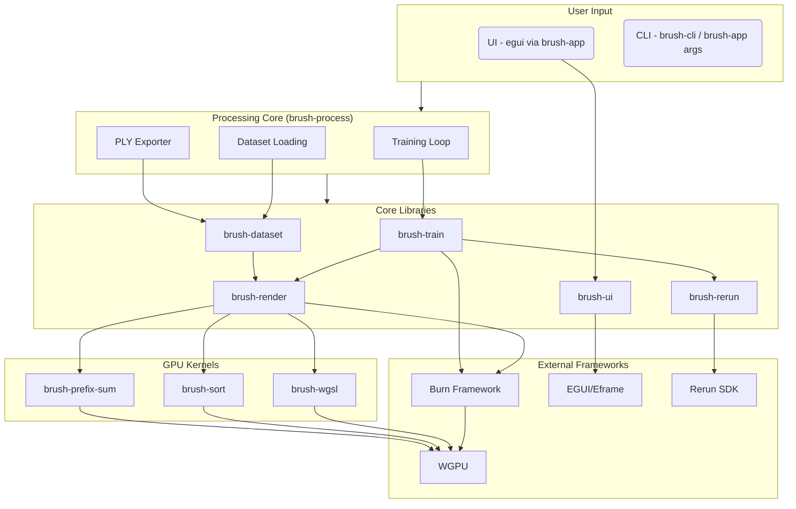

# 3.1 Architecture Overview

This section describes the overall structure of the Brush codebase.

## 3.1.1 Project Structure

Brush is organized as a [Rust Workspace](https://doc.rust-lang.org/book/ch14-03-cargo-workspaces.html), a standard Cargo feature for managing multiple related packages within a single project structure. The root directory contains several key configuration and informational files:

*   **`Cargo.toml` & `Cargo.lock`:** Defines the workspace members (all crates within `crates/`), dependencies, features, and locks specific dependency versions for reproducible builds.
*   **`rust-toolchain.toml`:** Specifies the exact Rust toolchain version used for development, ensuring consistency.
*   **`Trunk.toml`:** Configures the build process for the WebAssembly (WASM) target using the [Trunk](https://trunkrs.dev/) tool.
*   **`README.md`:** Provides a high-level overview, quick start instructions, and links to further documentation.
*   **`CONTRIBUTING.md`:** Outlines guidelines for contributing to the project.
*   **`LICENSE`:** Contains the project's open-source license information.
*   **`deny.toml`:** Configures `cargo-deny` for checking licenses, advisories, etc., across dependencies.
*   **`.github/workflows/`:** Contains CI/CD pipeline configurations (e.g., building, testing, releasing).

The core source code is organized into multiple interconnected crates located within the **`crates/`** directory. This modular approach promotes code reuse and separation of concerns. The specific roles of these crates are detailed in the next section.

## 3.1.2 Crate Breakdown

Brush is composed of several specialized crates, each handling a specific part of the functionality:

*   **`brush-app`**: The main graphical application crate (binary). It initializes the `eframe` window, sets up the different UI panels (`SettingsPanel`, `ScenePanel`, etc.), manages the application state (`AppContext`), handles user interactions (loading data, starting processes), and orchestrates communication between the UI, processing logic, and rendering.
*   **`brush-ui`**: Provides shared UI utilities and manages the integration between `egui`, `wgpu`, and `burn`. It includes helpers for setting up the `wgpu` device for `egui` (`create_egui_options`), drawing UI elements like checkerboards, and managing the display of `burn` tensors within `egui` textures (`burn_texture` module).
*   **`brush-process`**: Orchestrates the core data processing workflows. It determines whether to run the viewing stream (for `.ply` files) or the training stream (for datasets) based on the input `DataSource`. It manages the main loop (`process_stream`), handles process arguments (`ProcessArgs`), loads data via `brush-dataset`, invokes training via `brush-train`, and emits `ProcessMessage` updates for the UI.
*   **`brush-dataset`**: Defines data structures (`Dataset`, `Scene`, `SceneView`) and logic for loading and managing datasets. It includes parsers for different formats (COLMAP in `formats/colmap.rs`, Nerfstudio/JSON in `formats/nerfstudio.rs`), handles image loading (`LoadImage`) potentially with masks, manages a virtual filesystem abstraction (`brush_vfs`), and provides utilities for importing/exporting splats (`splat_import.rs`, `splat_export.rs`).
*   **`brush-train`**: Implements the core 3D reconstruction training logic. It defines the `SplatTrainer` which manages the optimization loop using a custom Adam optimizer (`adam_scaled.rs`) and learning rate schedules. It calculates the loss (L1 + SSIM), performs backpropagation using `brush-render-bwd`, and handles the Gaussian refinement process (densification/pruning).
*   **`brush-render`**: Contains the forward rendering pipeline for Gaussian Splatting. It defines the `Splats` structure holding Gaussian parameters, implements the `SplatForward` trait with the `render_splats` method, and includes WGSL shaders (`shaders/`) and kernel definitions (`kernels.rs`) for projecting and rasterizing splats onto the image plane.
*   **`brush-render-bwd`**: Implements the differentiable backward pass for the rendering pipeline. It defines `SplatForwardDiff` and `SplatBackwardOps` traits and uses custom WGSL kernels (`ProjectBackwards`, `RasterizeBackwards`) to compute gradients for the Gaussian parameters with respect to the rendered image loss, enabling training via `brush-train`.
*   **`brush-kernel`**: A utility crate for defining and compiling WGSL compute kernels for Burn's `Cube` backend. It provides the `kernel_source_gen!` macro for generating Rust boilerplate to integrate WGSL modules (processed by `brush-wgsl`) as `CubeTask`s, along with helpers for creating GPU tensors and uniform buffers.
*   **`brush-wgsl`**: Handles processing and composition of WGSL shader files. It uses `naga_oil` to manage imports (`@import`) between shader modules and includes a build script (`build.rs`) to generate Rust code (via `lib.rs`) that defines shader modules and potentially reflects WGSL structs into Rust structs.
*   **`brush-sort`**: Implements a GPU-accelerated radix sort algorithm (`radix_argsort`). Uses custom WGSL kernels compiled via `brush-kernel` to efficiently sort data (like Gaussian depths) on the GPU.
*   **`brush-prefix-sum`**: Provides a GPU-accelerated prefix sum (scan) operation (`prefix_sum`). Uses custom WGSL kernels compiled via `brush-kernel`, often used as a primitive within other parallel GPU algorithms like sorting.
*   **`brush-cli`**: Provides the command-line interface executable (`brush_app` binary, distinct from the GUI `brush-app`). Parses arguments using `clap` and likely uses `brush-process` to run operations without a graphical interface.
*   **`brush-rerun`**: Handles integration with the [Rerun](https://rerun.io/) visualization tool, allowing training progress, splats, and metrics to be logged and viewed externally.
*   **`colmap-reader`**: A utility crate specifically designed for parsing the COLMAP data format (reading `cameras.bin`/`txt`, `images.bin`/`txt`, `points3D.bin`/`txt`).
*   **`brush-android`**: Contains code specific to building and running the Brush application on the Android platform, including JNI bindings and build configurations.
*   **`sync-span`**: A small utility crate integrating with the `tracing` ecosystem. It provides a `tracing` layer (`SyncLayer`) that can automatically synchronize a Burn backend (e.g., wait for GPU operations to complete) when specific tracing spans are closed, useful for accurate performance profiling.
*   **`rrfd`**: Provides a cross-platform abstraction for native file dialogs (open file, save file, pick directory). Uses `rfd` on desktop/web and custom JNI calls on Android, allowing crates like `brush-app` to request file operations in a platform-agnostic way.

## 3.1.3 Data Flow

*   **Input:** User provides data via UI (file load, URL, preset) or CLI arguments (path, URL).
*   **Loading:** `brush-app` or `brush-cli` uses `brush-process` which leverages `brush-dataset` (and `brush_vfs`) to parse COLMAP/Nerfstudio formats, load images, and potentially initial splats.
*   **Training Loop (in `brush-process`):**
    *   Iteratively selects training image views (`SceneView`) from `brush-dataset`.
    *   Uses `brush-train` (which uses `brush-render`, `brush-sort`, `brush-prefix-sum`) to perform forward/backward passes, updating Gaussian parameters (position, SH, opacity, scale, rotation).
    *   Handles densification and pruning.
    *   Optionally logs data to Rerun via `brush-rerun`.
*   **Rendering (in `brush-viewer` / `brush-app`):**
    *   Takes current Gaussians from `brush-train` or loaded `.ply`.
    *   Uses `brush-render` (and associated kernels) to render the splats to the Scene panel via `wgpu`.
    *   UI (`egui`) interacts with `brush-app` context to display stats, handle controls, etc.
*   **Export:** User triggers export via UI or CLI; `brush-process` uses `brush-dataset::splat_export` to write the current splats to a `.ply` file.

*(Note: This diagram simplifies interactions. For example, `brush-app` orchestrates many calls between these components.)*

## 3.1.4 Cross-Platform Strategy

Brush achieves its wide platform support (Desktop, Web, Android) primarily through:

*   **Rust's Conditional Compilation:** Using `#[cfg(...)]` attributes and potentially the `cfg-if` crate to include or exclude code based on the target operating system (`target_os`) or architecture (`target_arch = "wasm32"`).
*   **WebGPU (`wgpu`):** The `wgpu` crate provides a graphics and compute API that abstracts over native APIs (Vulkan, Metal, DirectX 12) and WebGPU in the browser, enabling portable GPU code for rendering and compute kernels.
*   **Eframe/EGUI:** The UI library [Eframe](https://github.com/emilk/egui/tree/master/crates/eframe) (which uses EGUI) provides backends for both native platforms and WebAssembly, allowing the same UI code (`brush-ui`) to run across targets.
*   **Burn Framework:** The [Burn](https://github.com/tracel-ai/burn) ML framework is designed with portability in mind and features a `wgpu` backend, allowing ML models and training logic (`brush-train`) to run on the GPU across platforms.
*   **WASM Tooling (`wasm-bindgen`, `Trunk`):**
    *   `wasm-bindgen` facilitates communication between the compiled Rust code (WASM) and JavaScript in the browser.
    *   `Trunk` simplifies the process of building the Rust code to WASM, managing JavaScript interop, and bundling assets for web deployment.
*   **Platform-Specific Crates:** For functionality unique to a platform (like Android integration), a dedicated crate (`brush-android`) is used, containing platform-specific code and APIs.

---

## Where to Go Next?

*   Learn how reconstruction works: **[Reconstruction Pipeline](reconstruction-pipeline.md)**.
*   Understand the rendering process: **[Rendering Pipeline](rendering-pipeline.md)**.
*   See how the tech stack fits together: **[Core Technologies Guide](core-technologies.md)**.
*   Explore the code: **[API Reference](../api-reference.md)**. 
