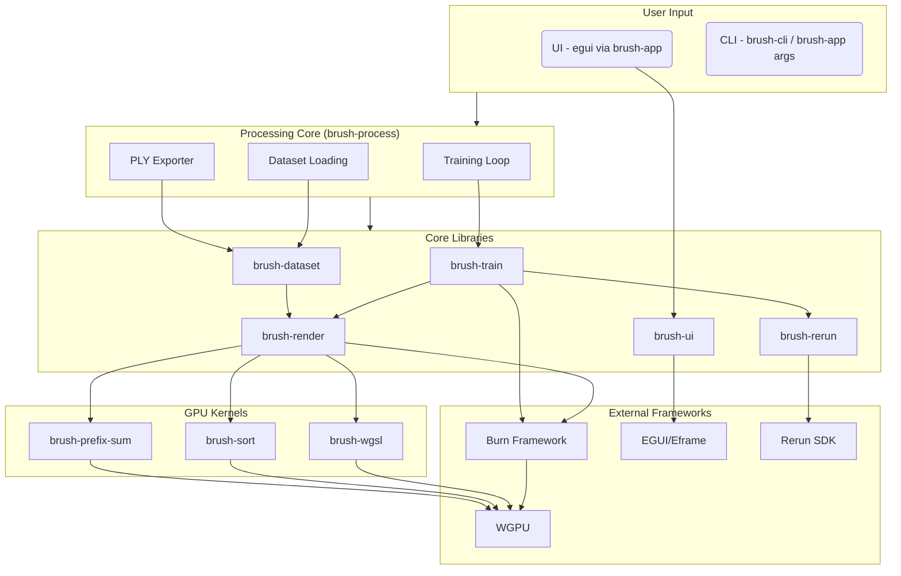

# 3.1. Architecture Overview

This section describes the overall structure of the Brush codebase.

## 3.1.1. Monorepo Structure

Brush utilizes a Rust workspace managed by Cargo, defined in the root `Cargo.toml` file. This workspace approach organizes the project into multiple interconnected crates (packages).

The key directories are:

*   `crates/`: Contains all the individual Rust crates that make up the Brush library and applications.
*   `examples/`: Contains standalone example applications demonstrating specific features or usage patterns.

The `Cargo.toml` in the root specifies `members = ["crates/*", "examples/*"]`, meaning all subdirectories within `crates/` and `examples/` are treated as members of the workspace.

## 3.1.2. Crate Breakdown

Brush is composed of several specialized crates, each handling a specific part of the functionality:

*(Note: Descriptions are based on crate names and project context. Further code analysis is needed for complete accuracy.)*

*   **`brush-app`**: Likely the main application crate, orchestrating the UI, rendering, and training processes. It serves as the primary entry point for the desktop application.
*   **`brush-ui`**: Contains the user interface components, built using the [EGUI](https://github.com/emilk/egui) library.
*   **`brush-process`**: Handles data loading, parsing, and preprocessing steps necessary before training or rendering (e.g., reading image data, handling masks).
*   **`brush-dataset`**: Defines structures and logic for managing datasets, including handling formats like COLMAP and Nerfstudio.
*   **`brush-train`**: Implements the core 3D reconstruction training logic, utilizing the [Burn](https://github.com/tracel-ai/burn) framework for machine learning tasks (optimization, automatic differentiation).
*   **`brush-render`**: Contains the forward rendering pipeline logic for Gaussian Splatting.
*   **`brush-render-bwd`**: Implements the backward pass for rendering, necessary for training the Gaussian Splat parameters.
*   **`brush-kernel`**: Contains low-level compute kernels, likely written using `wgpu` or WGSL for GPU acceleration of tasks like rasterization.
*   **`brush-wgsl`**: May specifically hold WGSL shader code used by `brush-kernel` or `wgpu`.
*   **`brush-sort`**: Implements GPU-accelerated sorting algorithms, crucial for the Gaussian Splatting rendering order.
*   **`brush-prefix-sum`**: Provides GPU-accelerated prefix sum (scan) operations, often used in parallel algorithms like sorting or stream compaction.
*   **`brush-cli`**: Provides the command-line interface executable (`brush`).
*   **`brush-rerun`**: Handles integration with the [Rerun](https://rerun.io/) visualization tool.
*   **`colmap-reader`**: A utility crate specifically for parsing the COLMAP data format.
*   **`brush-android`**: Contains code specific to building and running Brush on the Android platform.
*   **`sync-span`:** A small utility crate integrating with the `tracing` ecosystem. It provides a `tracing` layer (`SyncLayer`) that can automatically synchronize a Burn backend (e.g., wait for GPU operations to complete via `Backend::sync`) when specific, designated tracing spans are closed. This is likely used for debugging or performance analysis to ensure operations within certain spans finish before proceeding.
*   **`rrfd`:** Provides a cross-platform abstraction layer for native file dialog operations (picking files, picking directories, saving files). It uses the `rfd` crate for desktop/web platforms and custom Android JNI calls for Android, allowing UI code to request file operations without platform-specific logic.

## 3.1.3. Data Flow

*   **Input:** User provides data via UI (file load, URL, preset) or CLI arguments (path, URL).
*   **Loading:** `brush-app` or `brush-cli` uses `brush-process` which leverages `brush-dataset` (and `brush_vfs`) to parse COLMAP/Nerfstudio formats, load images, and potentially initial splats.
*   **Training Loop (in `brush-process`):**
    *   Iteratively selects training image views (`SceneView`) from `brush-dataset`.
    *   Uses `brush-train` (which uses `brush-render`, `brush-sort`, `brush-prefix-sum`) to perform forward/backward passes, updating Gaussian parameters (position, SH, opacity, scale, rotation).
    *   Handles densification and pruning.
    *   Optionally logs data to Rerun via `brush-rerun`.
*   **Rendering (in `brush-viewer` / `brush-app`):**
    *   Takes current Gaussians from `brush-train` or loaded `.ply`.
    *   Uses `brush-render` (and associated kernels) to render the splats to the Scene panel via `wgpu`.
    *   UI (`egui`) interacts with `brush-app` context to display stats, handle controls, etc.
*   **Export:** User triggers export via UI or CLI; `brush-process` uses `brush-dataset::splat_export` to write the current splats to a `.ply` file.

*(Note: This diagram simplifies interactions. For example, `brush-app` orchestrates many calls between these components.)*

## 3.1.4. Cross-Platform Strategy

Brush achieves its wide platform support (Desktop, Web, Android) primarily through:

*   **Rust's Conditional Compilation:** Using `#[cfg(...)]` attributes and potentially the `cfg-if` crate to include or exclude code based on the target operating system (`target_os`) or architecture (`target_arch = "wasm32"`).
*   **WebGPU (`wgpu`):** The `wgpu` crate provides a graphics and compute API that abstracts over native APIs (Vulkan, Metal, DirectX 12) and WebGPU in the browser, enabling portable GPU code for rendering and compute kernels.
*   **Eframe/EGUI:** The UI library [Eframe](https://github.com/emilk/egui/tree/master/crates/eframe) (which uses EGUI) provides backends for both native platforms and WebAssembly, allowing the same UI code (`brush-ui`) to run across targets.
*   **Burn Framework:** The [Burn](https://github.com/tracel-ai/burn) ML framework is designed with portability in mind and features a `wgpu` backend, allowing ML models and training logic (`brush-train`) to run on the GPU across platforms.
*   **WASM Tooling (`wasm-bindgen`, `Trunk`):**
    *   `wasm-bindgen` facilitates communication between the compiled Rust code (WASM) and JavaScript in the browser.
    *   `Trunk` simplifies the process of building the Rust code to WASM, managing JavaScript interop, and bundling assets for web deployment.
*   **Platform-Specific Crates:** For functionality unique to a platform (like Android integration), a dedicated crate (`brush-android`) is used, containing platform-specific code and APIs.

---

## Where to Go Next?

*   Learn how reconstruction works: **[Reconstruction Pipeline](reconstruction-pipeline.md)**.
*   Understand the rendering process: **[Gaussian Splat Rendering](gaussian-splatting.md)**.
*   See how the tech stack fits together: **[Core Technologies Guide](core-technologies.md)**.
*   Explore the code: **[API Reference](../api-reference.md)**. 
