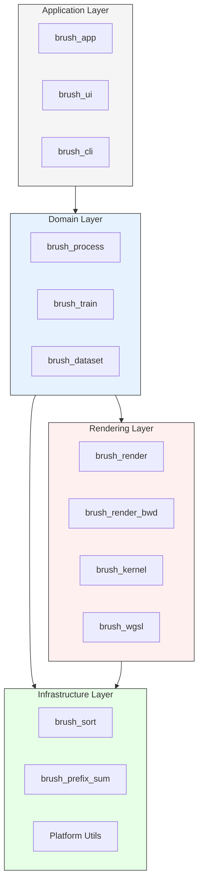

# 4. API Reference

This section provides a guide to Brush's API documentation, organized by architectural layer and core functionality.

## 4.1 Documentation Structure

The API documentation is organized to reflect Brush's layered architecture:



## 4.3 Feature Flags

Brush provides several feature flags to control optional functionality:

### Performance Tracing
```toml
# Enable performance tracing via the 'tracing' feature
# Example in Cargo.toml:
# brush-render = { path = "../brush-render", features = ["tracing"] }
# brush-train = { path = "../brush-train", features = ["tracing"] }
```

## 4.4 Example Usage

### Training Configuration
```rust
use brush_train::train::TrainConfig;

let config = TrainConfig {
    total_steps: 30000,
    ssim_weight: 0.2,
    lr_mean: 4e-5,
    lr_mean_end: 4e-7,
    mean_noise_weight: 1e4,
    lr_coeffs_dc: 3e-3,
    lr_coeffs_sh_scale: 20.0,
    lr_opac: 3e-2,
    lr_scale: 1e-2,
    lr_scale_end: 6e-3,
    lr_rotation: 1e-3,
    opac_loss_weight: 1e-8,
    refine_every: 150,
    growth_grad_threshold: 0.00085,
    growth_select_fraction: 0.1,
    growth_stop_iter: 12500,
    match_alpha_weight: 0.1,
    max_splats: 10000000,
    ..Default::default()
};
```

### Dataset Loading
```rust
use brush_dataset::{LoadDataseConfig, ModelConfig};

let load_config = LoadDataseConfig {
    max_frames: None,
    max_resolution: 1920,
    eval_split_every: None,
    subsample_frames: None,
    subsample_points: None,
};

let model_config = ModelConfig {
    sh_degree: 3,
};
```

### Rendering
```rust
use brush_render::render_forward;

let (out_img, aux) = render_forward(
    means,
    log_scales,
    quats,
    sh_coeffs,
    opacities,
    camera,
    img_size,
    bwd_info,
);
```

## 4.4 Generating Documentation

To generate and view the complete API documentation:

1. **Generate Docs:**
   ```bash
   # Basic documentation
   cargo doc --workspace --no-deps --open

   # Include private items
   cargo doc --workspace --no-deps --document-private-items
   ```

2. **Documentation Location:**
   - HTML docs are generated in `target/doc/`
   - Each crate has its own section
   - Index page provides a searchable interface

3. **Key Documentation Areas:**
   - Public interfaces and types
   - Module structure and relationships
   - Feature flag documentation
   - Platform-specific functionality

## Where to Go Next?

- **Architecture:** Return to [Architecture Overview](technical-deep-dive/architecture.md)
- **Implementation:** See [Reconstruction Pipeline](technical-deep-dive/reconstruction-pipeline.md) and [Rendering Pipeline](technical-deep-dive/rendering-pipeline.md)
- **Development:** Check the [Developer Guide](getting-started/developer-guide.md)
- **Contributing:** Read the [Contribution Guidelines](../CONTRIBUTING.md) 