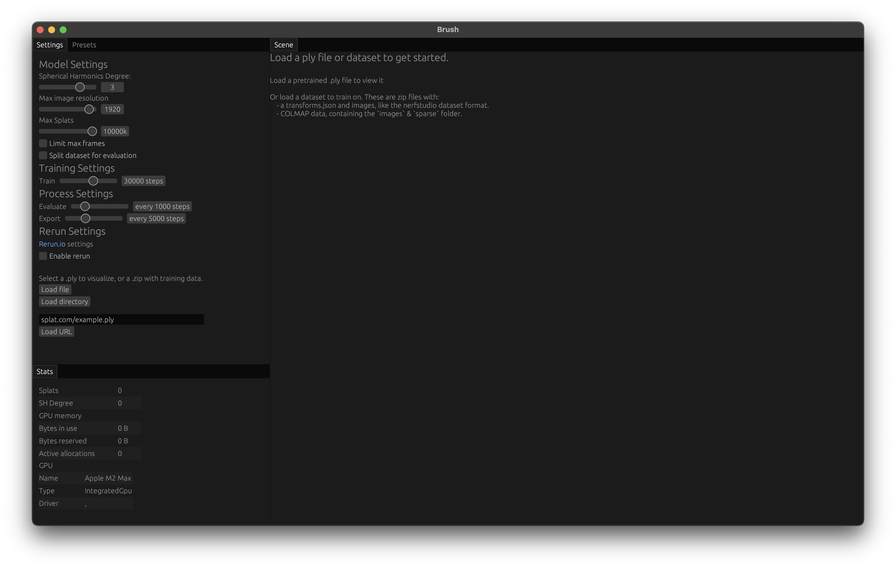
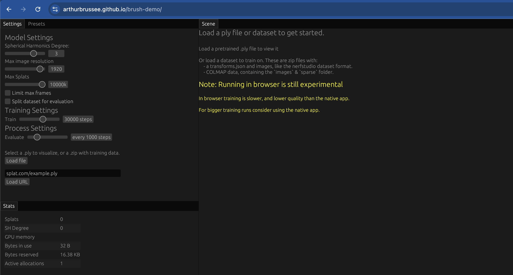
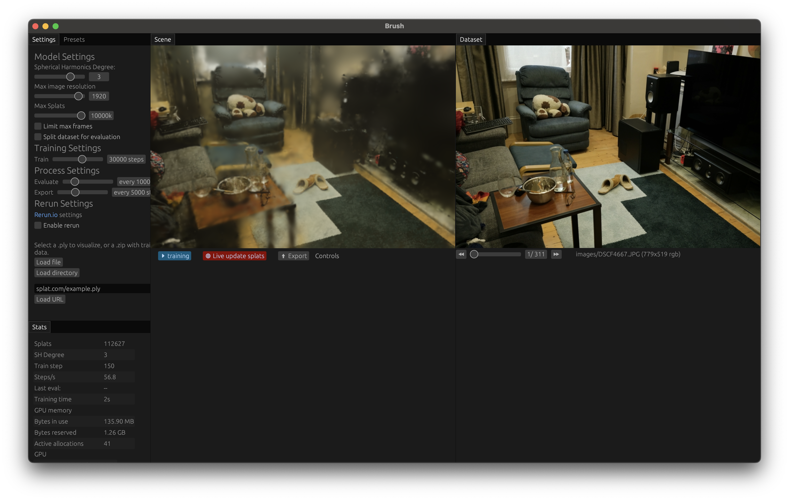

# 2.1 User Guide

This guide helps end-users install and use the Brush Graphical User Interface (UI).

**Contents:**
- [Installation](#211-installation)
  - [Desktop](#desktop)
  - [Web (WASM)](#web-wasm)
  - [Android](#android)
- [Prerequisites for Workflows](#212-prerequisites-for-workflows)
- [Core UI Workflows](#213-core-ui-workflows)
  - [Train a Scene](#workflow-1-train-a-scene)
  - [Export Trained Scene](#workflow-2-export-trained-scene)
  - [View Pre-trained Scene](#workflow-3-view-pre-trained-scene)
- [Using the Command Line Interface](#214-using-the-command-line-interface-cli)
- [Hardware & Software Requirements](#215-hardware--software-requirements)


**Quick Start:** Want to see Brush in action right away? See the **[Web (WASM) Installation section](#web-wasm)** below for links to the live demo and example scenes.

## 2.1.1 Installation

Brush can be run on Desktop (macOS, Windows, Linux), Android, and the Web.


*Initial Brush screen when launching the Mac desktop client.* 
### Desktop

*   **Pre-built Binaries (Recommended):** The easiest way to install Brush on the desktop is to download a pre-built binary for your operating system.
    *   Binaries for **Linux (x86_64)**, **macOS (Apple Silicon)**, and **Windows (x86_64)** are automatically built for tagged releases.
    *   Look for the `.tar.gz` or `.zip` files under the "Assets" section of the latest **[GitHub Release](https://github.com/ArthurBrussee/brush/releases)**. Note that these are standalone executables, not full installers.

*   **Build from Source:** If pre-built binaries are not available or you need the latest development version, see the **[Developer Guide](developer-guide.md#222-building-the-project)** for build instructions.

### Web (WASM)

*   **Hosted Demo (Experimental):** A hosted demo is available for quick viewing, but may not support all features (especially training) reliably.
    *   **[Live Web Demo Link](https://arthurbrussee.github.io/brush-demo)**
    *   Example viewing a pre-trained `.ply`: **[Garden Scene Demo](https://arthurbrussee.github.io/brush-demo/?url=https://f005.backblazeb2.com/file/brush-splats-bakfiets/garden.ply&focal=1.0&zen=true)**

    

*   **Build from Source (for Development):** If you need to run a local development version:
    1.  Follow the **[Developer Guide](developer-guide.md#221-development-environment-setup)** to set up your environment (Rust, WASM target, Trunk).
    2.  Build and serve locally: `trunk serve --open`

> [!WARNING]
>   **Training on Web:** As of early 2025, training new datasets directly within the web version may not work due to an issue in the underlying Burn library ([tracel-ai/burn#2901](https://github.com/tracel-ai/burn/issues/2901)). Viewing pre-trained `.ply` files should work correctly.

### Android

*   Refer to the specific instructions in `crates/brush-android/README.md` for building and running on Android. This README covers the necessary setup steps, including potential Android Studio, SDK, and NDK requirements.

## 2.1.2 Prerequisites for Workflows

Before starting the workflows below, ensure you have:

1.  **Open Brush:** Either by running a downloaded pre-built binary, using `cargo run`, running the web version via `trunk serve`, or accessing the web demo.
2.  **Verify Compatible Hardware:** Ensure your system meets the **[Hardware & Software Requirements](#215-hardware--software-requirements)**.
3.  **A Dataset or PLY File:**
    *   **For training:** A dataset suitable for Gaussian Splatting, provided as a `.zip` archive or an unzipped folder (native desktop only), containing data in COLMAP or Nerfstudio format. Common sources include:
        *   The original **[3D Gaussian Splatting project page](https://repo-sam.inria.fr/fungraph/3d-gaussian-splatting/)**.
        *   The original **[NeRF project page](https://www.matthewtancik.com/nerf)**.
    *   **For viewing:** A pre-trained Gaussian Splat model saved as a `.ply` file. Example files (from v0.2.0 release):
        *   Garden scene: 
            ```
            https://f005.backblazeb2.com/file/brush-splats-bakfiets/garden.ply
            ```
        *   Mushroom scene:
            ```
            https://f005.backblazeb2.com/file/brush-splats-bakfiets/mushroom_centered.ply
            ```
    *   You can also find dataset download links via the `Presets` tab in the Brush UI.

> [!NOTE]
> Brush does not create datasets from raw images or video itself (unlike tools like Nerfstudio which may include this capability). You need to use external tools like COLMAP first, or find pre-processed datasets.

## 2.1.3 Core UI Workflows

This section outlines the main tasks performed using the Brush UI:

### Workflow 1: Train a Scene

This workflow involves loading a dataset and training the Gaussian Splatting model.


*Desktop client running on a Macbook showing training in progress on the "room" dataset.*

1.  **Load Dataset:**
    *   Go to the **Settings** panel (see **[UI Overview](ui-overview.md#settings-panel)** for details).
    *   Use the `Load file` button (for `.zip` archives) or `Load directory` button (for unzipped folders, native desktop only), OR paste a URL to a `.zip` dataset and click `Load URL`.
    *   Loading a dataset suitable for training will typically start the reconstruction process automatically based on the default `Train` steps setting.
2.  **Monitor Training:**
    *   Watch the **Scene** panel to see the Gaussian splats visually refining over time. You can toggle "Live update splats" in the Scene panel to disable visual updates for potentially better performance, without stopping the background training.
    *   Observe the **Stats** panel for metrics like `Train step`, `Steps/s`, `Splats` count, and evaluation results (`Last eval:`) if enabled.
3.  **(Optional) Adjust Settings During Training:**
    *   You can adjust parameters in the **Settings** panel during training, affecting aspects like quality (e.g., `Spherical Harmonics Degree`, `Max Splats`) or performance (e.g., `Max image resolution`). Major changes might require stopping and reloading. See the **[UI Overview](ui-overview.md#settings-panel)** for details on each setting.
4.  **Training Completion:** Training stops automatically when the target number of `Train` steps is reached. You can often stop it manually via the blue training status button in the UI. To restart training with different settings or data, you typically need to reload the dataset.

> [!NOTE]
> **When is training "Done"?** Training doesn't have a strict endpoint. It's often stopped when visual quality is sufficient, evaluation metrics plateau (stop improving significantly), or the default target steps (e.g., 30,000) are reached. Experimentation is often needed.

### Workflow 2: Export Trained Scene

Once training is complete or has reached a satisfactory state, you can save the resulting Gaussian Splat model.

*   **Manual Export:** Click the `⬆ Export` button at the bottom of the **Scene** panel. Choose a filename and location to save the scene as a `.ply` file.
*   **Automatic Checkpoints (Native Desktop Only):** In the **Settings** panel, set the `Export` slider to save `.ply` checkpoints automatically every N steps during training. By default, these are saved to the directory where Brush was launched, with names like `export_5000.ply`, `export_10000.ply`, etc., based on the iteration number (this path and name pattern can be overridden via CLI arguments).

### Workflow 3: View Pre-trained Scene

This workflow focuses on loading and viewing an existing `.ply` Gaussian Splat file. There are two ways to load a pre-trained scene:

1.  **Load PLY File:**
    *   Go to the **Settings** panel.
    *   Either:
        *   Use the `Load file` button to select a local `.ply` file, OR
        *   Paste a direct URL to a `.ply` file and click `Load URL`.
    *   The scene will load and appear in the **Scene** panel.

2.  **Direct URL Loading (Web Demo):**
    *   For quick sharing or embedding, you can link directly to the web demo with a scene:
        ```
        https://arthurbrussee.github.io/brush-demo/?url=<URL_TO_PLY_FILE>
        ```
    *   Optional parameters:
        *   `focal=<FLOAT>`: Sets an initial focal length override
        *   `zen=true`: Launches in "Zen Mode" with UI panels minimized

    For example, view the [Garden Scene directly](https://arthurbrussee.github.io/brush-demo/?url=https://f005.backblazeb2.com/file/brush-splats-bakfiets/garden.ply&focal=1.0&zen=true).


*Brush web demo loading the garden scene directly from a URL with Zen mode enabled.* 

**Viewing the Scene:**
The loaded scene appears in the **Scene** panel where you can navigate using standard 3D controls (see **[UI Overview](ui-overview.md#scene-panel)** for details).

**Panel States:**
*   The **Dataset** panel will be empty since there are no source images for a pre-trained scene
*   The **Stats** panel shows `Splats` count, `SH Degree`, and `Frames` (if animated)
*   The **Settings** panel options do not affect pre-trained scene viewing

## 2.1.4 Using the Command Line Interface (CLI)

While this guide focuses on the UI, Brush also offers a command-line interface via the `brush` executable (if built with `-p brush-cli`), or potentially via `brush_app` with specific flags depending on build configuration. Running the CLI performs the core operations headlessly.

Run `./target/release/brush --help` (or `brush_app --help`) for a full list of options.

**Common Examples:**

*   **Viewing a `.ply` file (Headless - just loads and exits, primarily for testing):**
    ```bash
    ./target/release/brush /path/to/your/splat.ply
    ```
*   **Starting Training (Headless):**
    ```bash
    ./target/release/brush --dataset /path/to/dataset --export-path /path/to/output_dir --total-steps 30000 --export-name final_splats.ply
    ```
*   **Training with Adjusted Parameters (Headless):**
    ```bash
    ./target/release/brush --dataset /path/to/dataset --export-path /path/to/output_dir --total-steps 30000 --export-name final_splats.ply --sh-degree 1 --lr-mean 1e-4
    ```

For more advanced CLI usage and automation, refer to the help output and the **[Extending Brush](../technical-deep-dive/extending-brush.md)** guide.

## 2.1.5 Hardware & Software Requirements

*   **Operating Systems:**
    *   Desktop: macOS, Windows, Linux
    *   Mobile: Android
    *   Web: Browsers supporting WebGPU
*   **CPU/RAM:** While specific minimums aren't defined, a modern multi-core CPU (e.g., Intel Core i5/i7, AMD Ryzen 5/7, or Apple Silicon M1/M2/M3 series or newer) and at least 16GB of RAM are recommended for a smooth experience, especially during training. More complex datasets will benefit from more RAM (32GB+).
*   **GPU:**
    *   Requires a GPU with good driver support for one of the modern graphics APIs used by `wgpu`:
        *   **Metal:** On macOS (including Apple Silicon M-series chips) and iOS.
        *   **Vulkan:** On Linux, Android, and Windows.
        *   **DirectX 12:** On Windows.
    *   This includes most modern GPUs from Nvidia, AMD, Intel, Apple (M-series), and mobile vendors (Qualcomm Adreno, ARM Mali, etc.) on their respective compatible operating systems.
    *   **CUDA is NOT required.**
*   **Web Browsers:**
    *   Requires a recent version of a browser supporting WebGPU.

> [!IMPORTANT]
> Chrome 131+ is recommended as of early 2025. Firefox/Safari support may vary. Check [Can I use WebGPU?](https://caniuse.com/webgpu).


---

## Where to Go Next?

*   Learn about the different UI panels in detail: **[UI Overview](ui-overview.md)**.
*   Want to build the project yourself? See the **[Developer Guide](developer-guide.md)**.
*   Need definitions for terms? Check the **[Glossary](../supporting-materials/glossary.md)**.
*   Ran into issues? Look at the **[FAQ](../supporting-materials/faq.md)**. 