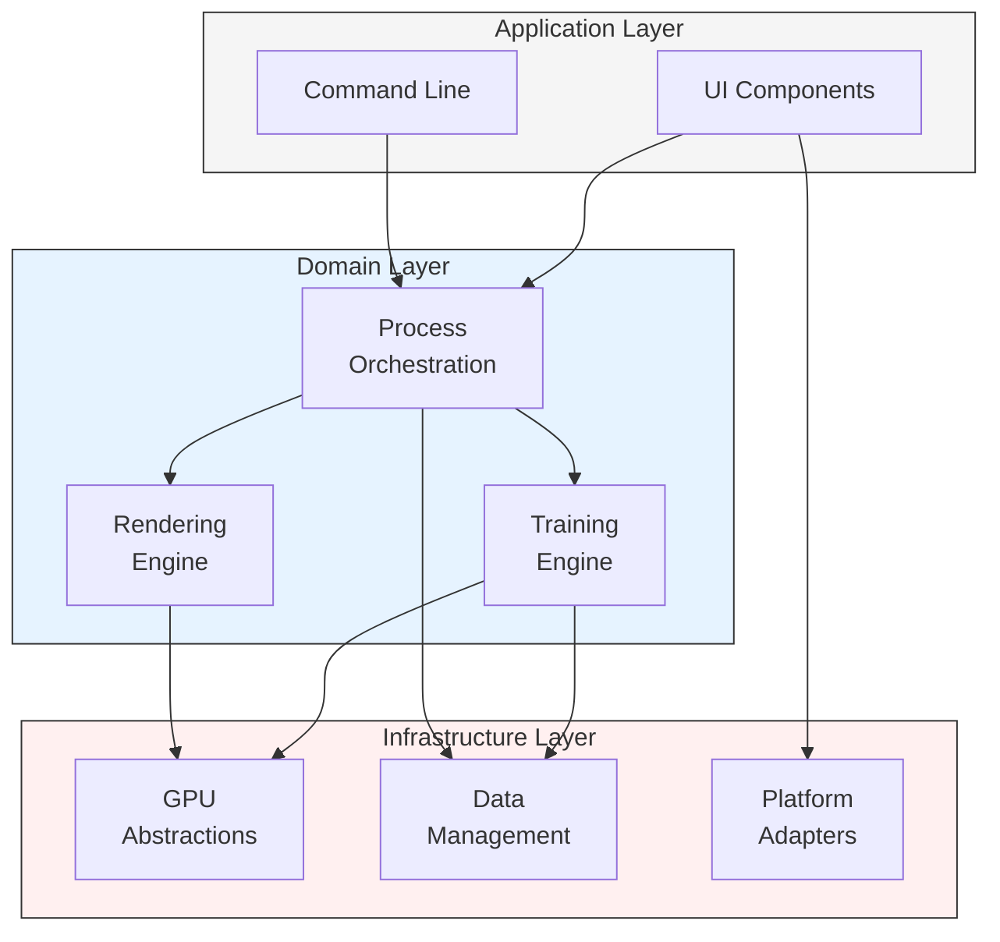
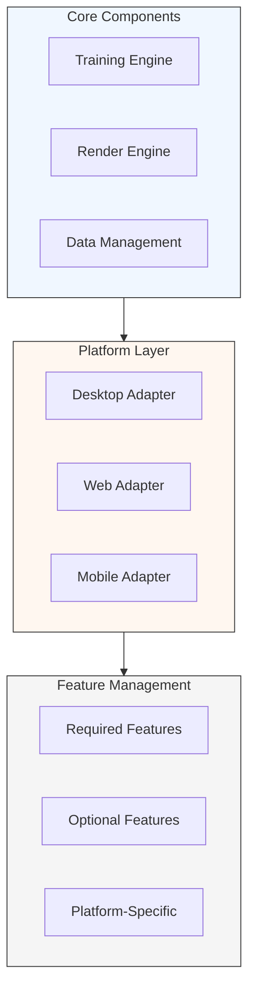

# 3. Architecture Overview

This section provides a high-level overview of Brush's architecture, followed by detailed explanations of key components and patterns.

## 3.1 System Overview

Brush is designed as a modular system with three primary workflows:
1. **Training:** Converting input images into optimized 3D Gaussian Splats
2. **Viewing:** Real-time rendering of Gaussian Splat scenes
3. **Extension:** Building custom applications using Brush components

These workflows are implemented through a layered architecture:

## 3.2 Core Architecture Patterns

Brush implements a layered architecture with several key patterns:

1. **GPU-Accelerated Rendering**
   - Uses WGPU/WGSL for cross-platform GPU support
   - Implements tile-based rendering with 16x16 tile size
   - Custom memory management for GPU buffers
   - Efficient data structures for splat representation

2. **Differentiable Training**
   - Built on Burn for GPU-accelerated autodiff
   - Custom AdamScaled optimizer with per-parameter learning rates
   - Efficient gradient computation through backward pass
   - Memory-efficient training with compact data structures

3. **Cross-Platform Support**
   - WebGPU for web deployment
   - Native GPU support for desktop
   - Unified API across platforms
   - Platform-specific optimizations

4. **Memory Management**
   - Efficient buffer reuse
   - Compact data structures
   - Smart memory allocation
   - Automatic cleanup

## 3.3 Cross-Platform Strategy

Brush achieves platform independence through a dedicated adaptation layer:

### Feature Management Matrix

| Category | Desktop | Web | Mobile |
|----------|---------|-----|---------|
| **Core Rendering** | Full GPU Pipeline | WebGPU Pipeline | Optimized Pipeline |
| **Training** | Full Capability | Memory-Constrained | Limited/Viewing Only |
| **Data Handling** | Local File System | Browser Storage + Remote | App Storage + Remote |
| **UI/UX** | Full Window System | Browser-Adapted | Touch-Optimized |

### Implementation Strategy

1. **Abstraction Layers**
   - Hardware abstraction through `wgpu`
   - Storage abstraction via Virtual File System
   - UI framework abstraction using `egui`

2. **Runtime Adaptation**
   - Dynamic feature detection
   - Resource-based capability scaling
   - Platform-optimized code paths
   - Performance monitoring:
     - GPU utilization tracking
     - Memory usage profiling
     - Frame time analysis

3. **Performance Considerations**
   - Platform-specific memory management
   - Render quality scaling
   - Computation workload adaptation
   - UI responsiveness optimization
   - Target metrics:
     - Desktop: Full quality, max performance
     - Web: Adaptive quality, 30+ FPS
     - Mobile: Power-efficient, 60+ FPS

## 3.4 Crate Breakdown

Brush is composed of several specialized crates, organized into the following categories:

### Application Layer

| Crate | Purpose | Key Components |
|-------|---------|----------------|
| `brush-app` | Main graphical application | - Initializes `eframe` window - Sets up UI panels - Manages application state - Orchestrates UI, processing, and rendering |
| `brush-ui` | UI utilities and integration | - Integrates `egui`, `wgpu`, and `burn` - Manages UI rendering and display - Provides UI element helpers |
| `brush-cli` | Command-line interface | - Provides CLI binary - Parses arguments via `clap` - Runs operations without GUI |

### Core Processing

| Crate | Purpose | Key Components |
|-------|---------|----------------|
| `brush-process` | Processing orchestration | - Manages viewing/training streams - Controls main processing loop - Coordinates data and training |
| `brush-train` | 3D reconstruction training | - Implements `SplatTrainer` - Manages optimization loop - Handles Gaussian refinement |
| `brush-dataset` | Dataset management | - Defines core data structures - Handles format parsing - Manages data I/O operations |

### Rendering Pipeline

| Crate | Purpose | Key Components |
|-------|---------|----------------|
| `brush-render` | Forward rendering | - Defines `Splats` structure - Implements rendering pipeline - Manages projection and rasterization |
| `brush-render-bwd` | Backward pass | - Implements differentiable rendering - Computes training gradients |
| `brush-kernel` | WGSL kernel utilities | - Manages GPU compute kernels - Integrates with Burn backend |
| `brush-wgsl` | Shader processing | - Handles WGSL shader composition - Generates Rust bindings |

### GPU Utilities

| Crate | Purpose | Key Components |
|-------|---------|----------------|
| `brush-sort` | GPU sorting | - Implements radix sort - Provides sorting kernels |
| `brush-prefix-sum` | GPU prefix sum | - Implements parallel scan - Supports GPU algorithms |

### Platform & Utilities

| Crate | Purpose | Key Components |
|-------|---------|----------------|
| `brush-android` | Android support | - Platform-specific bindings - JNI integration |
| `brush-rerun` | Visualization tools | - Training progress logging - Metric visualization |
| `colmap-reader` | Format parsing | - COLMAP format support - Camera/image parsing |
| `sync-span` | Profiling utilities | - GPU operation sync - Performance tracing |
| `rrfd` | File dialogs | - Cross-platform file operations |

## Where to Go Next?

For detailed information about specific components:

- **Training Process:** See the [Reconstruction Pipeline](reconstruction-pipeline.md#training-workflow)
- **Rendering Details:** Explore the [Rendering Pipeline](rendering-pipeline.md#viewing-workflow)
- **API Documentation:** Browse the [API Reference](../api-reference.md)
- **Extension Points:** Learn about [Extending Brush](extending-brush.md)