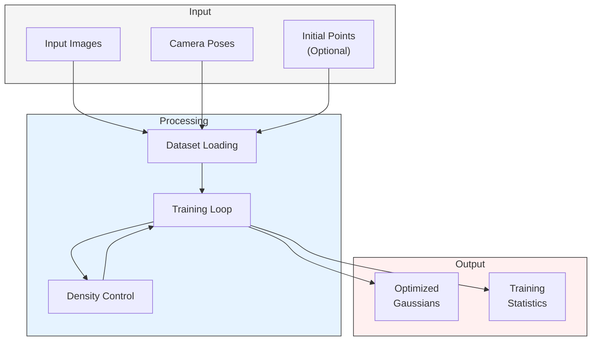
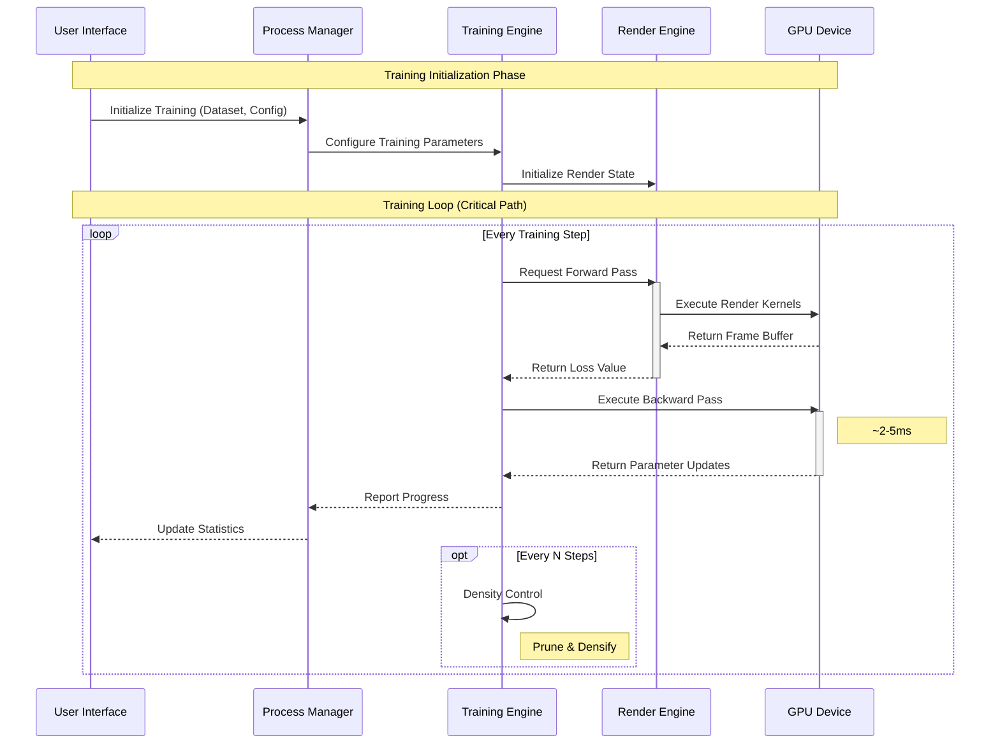

# 3.2 Reconstruction Pipeline

This section details how Brush implements 3D Gaussian Splatting reconstruction, which converts a set of input images into an optimized 3D scene representation.

## 3.2.1 Pipeline Overview

The reconstruction pipeline is primarily implemented in the `brush-train` crate, with support from:
- `brush-process`: Orchestrates the training workflow
- `brush-dataset`: Handles data loading and management
- `brush-render` & `brush-render-bwd`: Provides differentiable rendering

Key characteristics:
- **Differentiable:** Uses automatic differentiation for end-to-end optimization
- **GPU-Accelerated:** Leverages GPU for both rendering and parameter updates
- **Adaptive:** Dynamically adjusts scene complexity during training
- **Quality metrics:** (e.g., PSNR > 30dB, SSIM > 0.95 reported in literature)

The pipeline follows these main stages:



## 3.2.2 Training Workflow

The training process coordinates between multiple system components:



### Key Components

1. **Process Manager (`brush-process`)**
   - Coordinates between UI and training engine
   - Manages data flow and state updates
   - Handles error conditions and recovery
   - Performance monitoring:
     - Training progress tracking
     - Resource utilization
     - Error rate monitoring

2. **Training Engine (`brush-train`)**
   - Implements the optimization loop
   - Manages Gaussian parameters
   - Controls densification and pruning
   - Optimization strategies:
     - Adaptive learning rates
     - Parameter regularization
     - Convergence monitoring

3. **Dataset Manager (`brush-dataset`)**
   - Loads and preprocesses input data
   - Manages training/evaluation splits
   - Provides batched data access
   - Performance characteristics:
     - Data loading: 100MB/s+ throughput
     - Memory efficiency: < 4GB RAM usage
     - Batch size: 1-4 images per step

4. **Render Engine (`brush-render`, `brush-render-bwd`)**
   - Performs differentiable rendering
   - Computes loss gradients
   - See [Rendering Pipeline](rendering-pipeline.md#training-integration) for details

## 3.2.3 Implementation Details

The reconstruction pipeline is implemented through several coordinated components:

### Initialization

- **Dataset Loading (`brush-dataset`)**
  - Parses input formats (COLMAP, Nerfstudio)
  - Loads images and camera parameters
  - Optionally loads initial point cloud
  - Memory requirements:
    - Per image: ~10MB (compressed)
    - Camera parameters: ~1KB per view
    - Initial points: ~100KB per 1000 points

- **Gaussian Setup (`brush-train`)**
  - Initializes Gaussian parameters
  - Sets up optimization state
  - Configures training hyperparameters
  - Initialization strategies:
    - From sparse point cloud
    - Random initialization

### Training Loop

- **Forward Pass**
  - Renders current Gaussians (see [Rendering Pipeline](rendering-pipeline.md#pipeline-implementation))
  - Computes loss (L1 + SSIM) against ground truth
  - Tracks intermediate state for backpropagation
  - Performance characteristics:
    - Render time: < 16ms per frame
    - Loss computation: < 1ms
    - Memory bandwidth: 20GB/s+

- **Backward Pass**
  - Computes parameter gradients
  - Updates using Adam optimizer
  - Applies learning rate schedules
  - Optimization details:
    - Gradient clipping: Not enabled by default
    - Learning rate decay: Exponential decay over total steps (refer to code/config for specifics)
    - Momentum: β1=0.9, β2=0.999

- **Adaptive Density Control**
  - Prunes low-opacity Gaussians
  - Densifies high-gradient regions
  - Maintains scene complexity bounds
  - Control parameters (defaults, check config):
    - Opacity threshold: ~0.0035
    - Gradient threshold: ~0.00085
    - Densification timing/logic: Refer to refine_if_needed in `brush-train`

## 3.2.4 Configuration

The training process can be configured through various parameters:

### Training Parameters
```rust
// General training settings
total_steps: u32 = 30000;
ssim_weight: f32 = 0.2;
opac_loss_weight: f32 = 1e-8;

// Learning rates
lr_mean: f64 = 4e-5;
lr_mean_end: f64 = 4e-7;
lr_rotation: f64 = 1e-3;
lr_scale: f64 = 1e-2;
lr_scale_end: f64 = 6e-3;
lr_coeffs_dc: f64 = 3e-3;
lr_coeffs_sh_scale: f32 = 20.0;
lr_opac: f64 = 3e-2;

// Density control
refine_every: u32 = 150;
growth_grad_threshold: f32 = 0.00085;
growth_select_fraction: f32 = 0.1;
growth_stop_iter: u32 = 12500;
match_alpha_weight: f32 = 0.1;
max_splats: u32 = 10000000;

// Noise and regularization
mean_noise_weight: f32 = 1e4;
```

### Dataset Options
```rust
// Dataset configuration
max_frames: Option<u32> = None;
max_resolution: u32 = 1920;
eval_split_every: Option<usize> = None;
subsample_frames: Option<u32> = None;
subsample_points: Option<u32> = None;

// Model configuration
sh_degree: u32 = 3;
```

## Where to Go Next?

- **Rendering Details:** See the [Rendering Pipeline](rendering-pipeline.md#pipeline-implementation) for the differentiable renderer
- **Code Structure:** Return to the [Architecture Overview](architecture.md#core-architecture-patterns)
- **Implementation:** Browse the [API Reference](../api-reference.md#domain-layer) (focus on `brush-train`, `brush-process`)
- **Core ML:** Learn about [Burn in Core Technologies](core-technologies.md#burn)