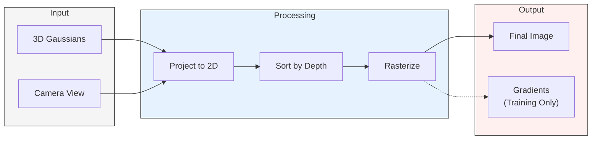
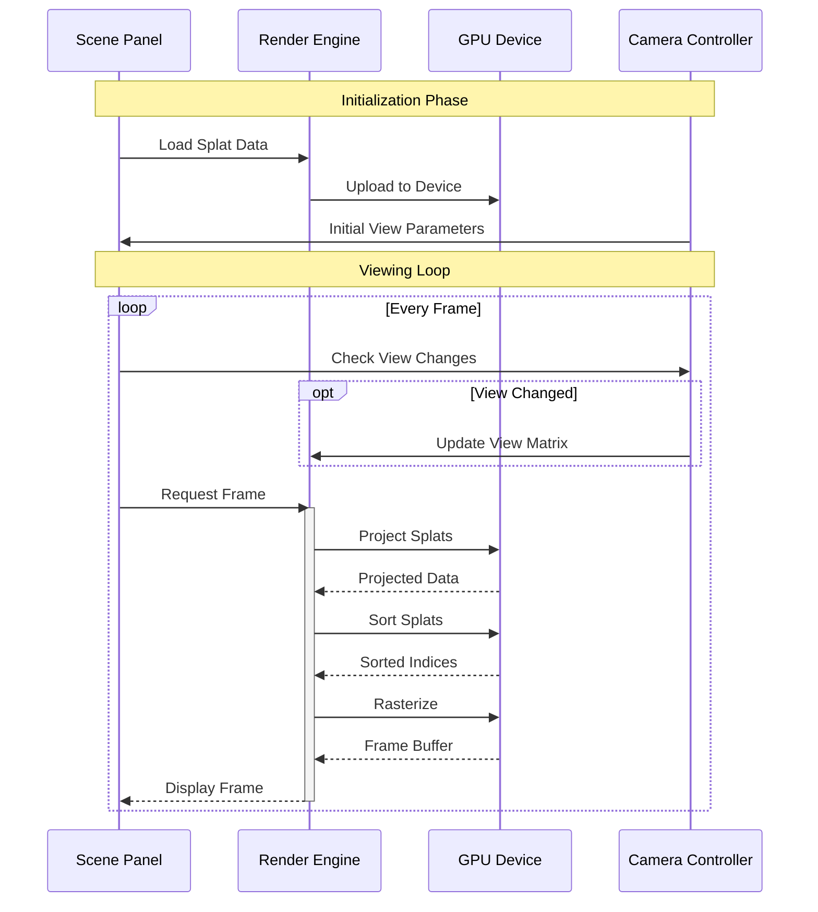
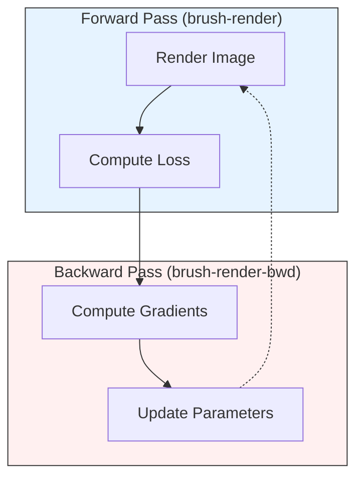

# 3.1 Rendering Pipeline

This section explains how Brush implements real-time rendering of 3D Gaussian Splats, a core component that serves both the viewing and training workflows.

## 3.1.1 Pipeline Overview

The rendering pipeline is implemented primarily in the `brush-render` crate, with support from GPU utilities in `brush-sort` and `brush-prefix-sum`. For training, an additional backward pass is provided by `brush-render-bwd`.

Key characteristics of the pipeline:
- **GPU-Accelerated:** Uses WebGPU (via `wgpu`) for cross-platform GPU support
- **Tile-Based:** Processes screen space in tiles for efficient parallel execution
- **Differentiable:** Supports gradient computation for training (when using `brush-render-bwd`)

The pipeline follows these main stages:

## 3.1.2 Viewing Workflow

The viewing workflow, primarily handled by `brush-app` and `brush-ui`, focuses on real-time rendering for interactive visualization:

### Key Components

1. **Scene Panel (`brush-ui`)**
   - Manages the viewport and user interaction
   - Handles camera control input
   - Displays the rendered frame
   - Performance targets:
     - Input latency: < 8ms
     - Camera update rate: 60Hz
     - Viewport resize: < 16ms

2. **Render Engine (`brush-render`)**
   - Manages the rendering pipeline stages
   - Coordinates GPU kernel execution
   - Handles view-dependent effects
   - Memory management:
     - GPU buffer pooling
     - Dynamic allocation limits
     - Memory defragmentation

3. **GPU Device**
   - Executes rendering kernels
   - Manages splat data in GPU memory
   - Performs sorting and rasterization
   - Performance characteristics:
     - Kernel execution: < 2ms per stage
     - Memory bandwidth: 20GB/s+
     - VRAM efficiency: < 4GB for 1M splats

4. **Camera Controller**
   - Processes user input
   - Updates view parameters
   - Manages camera movement
   - Smoothing and interpolation:
     - Camera path smoothing
     - View matrix interpolation
     - Motion prediction

## 3.1.3 Pipeline Implementation

The rendering pipeline is implemented through several GPU kernels and supporting operations:

1. **Projection (`project_forward`/`project_visible`)**
   - Transforms 3D Gaussians to 2D screen space
   - Computes view-dependent colors using Spherical Harmonics
   - Culls invisible splats
   - Performance optimizations:
     - Frustum culling
     - Backface culling
     - Screen-space bounds check

2. **Tile Mapping (`map_gaussian_to_intersects`)**
   - Determines which screen tiles each splat overlaps
   - Prepares data for efficient parallel processing
   - Memory layout:
     - Tile size: 16x16 pixels
     - Splat overlap tracking
     - Tile occupancy masks

3. **Sorting (`brush-sort`)**
   - GPU-based radix sort for depth ordering
   - Essential for correct alpha blending
   - Uses prefix sums (`brush-prefix-sum`) for efficient parallel operation
   - Performance characteristics:
     - Sort time: < 1ms for 1M splats
     - Memory bandwidth: 10GB/s+
     - Workgroup size: 256 threads

4. **Rasterization**
   - Accumulates color and opacity per pixel
   - Processes splats in front-to-back order
   - Handles alpha blending and early termination
   - Optimizations:
     - Early depth testing
     - Alpha cutoff
     - Tile-based processing

## 3.1.4 Training Integration

For training (detailed in [Reconstruction Pipeline](reconstruction-pipeline.md#training-workflow)), the rendering pipeline provides additional functionality through `brush-render-bwd`:

1. **Forward Pass State**
   - Saves intermediate results needed for gradient computation
   - Tracks projected splats, visibility, and tile information
   - Memory requirements:
     - Per-splat state: ~1KB
     - Per-tile state: ~256B
     - Total state size: O(N) where N is number of splats

2. **Backward Pass**
   - Computes gradients for Gaussian parameters
   - Integrates with Burn's automatic differentiation
   - Uses custom WGSL kernels for efficient gradient calculation
   - Performance characteristics:
     - Gradient computation: < 5ms
     - Memory bandwidth: 30GB/s+
     - Workgroup size: 128 threads

The training workflow reuses the same core rendering pipeline but adds gradient computation for optimization:

## Memory Requirements
- Each projected splat: 9 floats (36 bytes)
  - Position (xy_x, xy_y)
  - Conic matrix (conic_x, conic_y, conic_z)
  - Color (color_r, color_g, color_b, color_a)
- Tile bounds: Calculated as `ceil(image_size / TILE_WIDTH)`
- Maximum intersections: `min(num_splats * num_tiles, INTERSECTS_UPPER_BOUND)`
  - INTERSECTS_UPPER_BOUND = 256 * 2 * 65535 (workgroup size * 2 * max dispatches)

## Performance Characteristics
- Tile-based processing with 16x16 tile size
- GPU-accelerated using WGPU/WGSL
- Forward pass optimized for real-time viewing
- Backward pass supports differentiable rendering
- Memory-efficient through compact data structures
- Supports both viewing and training workflows

## Where to Go Next?

- **Training Process:** See how this pipeline is used in the [Reconstruction Pipeline](reconstruction-pipeline.md#training-workflow)
- **Implementation Details:** Browse the [API Reference](../api-reference.md#rendering-layer) (focus on `brush-render`, `brush-render-bwd`)
- **GPU Programming:** Learn about [WGPU/WGSL in Core Technologies](core-technologies.md#wgpu--wgsl)
- **Overall Structure:** Return to [Architecture Overview](architecture.md#core-architecture-patterns) 